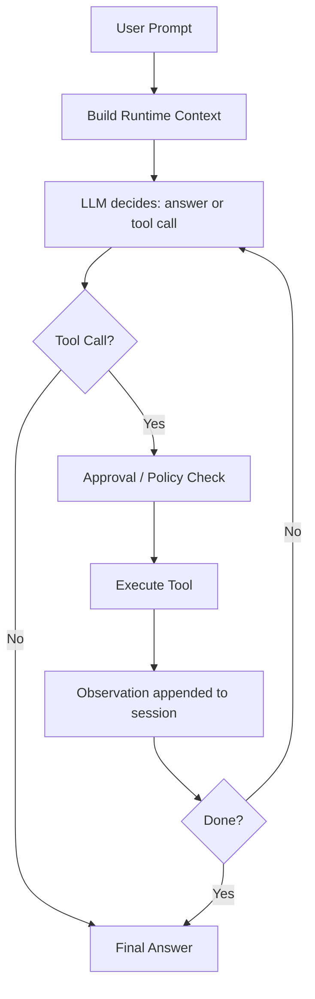
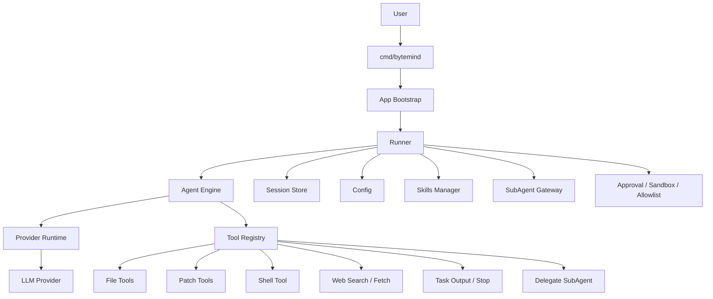

# ByteMind

> A terminal-native AI coding agent for real repositories.

AI inspects code, searches files, runs commands, edits files, plans tasks, and operates under configurable human approval — all inside your local Git repository.

<p align="center">

[](https://github.com/1024XEngineer/bytemind/actions)
[](./evals/README.md)
[](./DEMO.md)
[](https://codecov.io/gh/1024XEngineer/bytemind)
[](https://go.dev)
[]()

</p>

---

## 5-Minute Demo

A reproducible bug-fix cycle demonstrating ByteMind's full engineering loop — inspect, diagnose, patch, verify.

```bash
go run ./cmd/bytemind run \
  -prompt "Fix the failing test and verify it passes" \
  -workspace examples/bugfix-demo/broken-project \
  -approval-mode full_access
```

**The bug**: `CalculateAverage` returns `NaN` on empty slice (divide by zero).
**The fix**: Add a guard clause for `len(nums) == 0`.

| Step | Tool | What happens |
|------|------|-------------|
| 1 | `list_files` | Reads project structure |
| 2 | `read_file` | Reads source code and test file |
| 3 | `run_tests` | Discovers the failing test |
| 4 | `replace_in_file` | Fixes the divide-by-zero bug |
| 5 | `run_tests` | Verifies all tests pass |
| 6 | `git_diff` | Shows the exact change made |

**Offline verification** (no API key needed):

```bash
go run ./evals/runner.go -smoke -run bugfix_go_001
```

See [examples/bugfix-demo/](examples/bugfix-demo/README.md) for details and [DEMO.md](DEMO.md) for a judge-facing walkthrough.

---

## Engineering Evidence

ByteMind is built for evaluators who need reproducible, verifiable engineering output.

### Real Agent Loop

Multi-step tool use with observation feedback, context compaction, rate-limit retry, and execution budgets (`internal/agent/engine_run_loop.go`).

### Coding-native Tools

14 built-in tools for repository operations — `git_status`, `git_diff`, `run_tests`, file read/search/write/patch, shell execution, and web access. Each tool has unit tests and a safety classification.

### Reproducible Demo

`examples/bugfix-demo/broken-project` is a self-contained Go project that fails `go test ./...` initially and passes after agent fix. Complete with expected output and offline verification.

### Evaluation System

YAML-defined eval tasks run via `evals/runner.go` with flexible success criteria: command exit codes, output patterns, file content regex, and file modification detection.

### Safety Boundary

Three-layer safety model: approval policy (`on-request`/`always`/`never`), sandbox (off/best-effort/required), and runtime boundaries (writable roots, exec allowlist, network allowlist). See `bytemind safety explain`.

### CI and Testing

PR-gated CI: `go build ./...`, unit tests with coverage, sandbox acceptance on Linux/macOS/Windows, and eval smoke checks. See [`.github/workflows/ci.yml`](.github/workflows/ci.yml).

### Extensibility

Skills, MCP servers, and SubAgents for encoding reusable workflows and delegating focused work.

See [ENGINEERING.md](ENGINEERING.md) for detailed evidence.

---

## Quick Start

### Install

**macOS / Linux**
```bash
curl -fsSL https://raw.githubusercontent.com/1024XEngineer/bytemind/main/scripts/install.sh | bash
```

**Windows PowerShell**
```powershell
iwr -useb https://raw.githubusercontent.com/1024XEngineer/bytemind/main/scripts/install.ps1 | iex
```

### Configure
```bash
mkdir -p .bytemind
cp config.example.json .bytemind/config.json
```

### Run
```bash
# Interactive session
bytemind chat

# One-shot analysis
bytemind run -prompt "Analyze this repository and summarize the architecture"

# Multi-step task
bytemind run -prompt "Refactor this module and update tests" -max-iterations 64
```

---

## Built-in Tools

| Tool | Purpose |
| --- | --- |
| `list_files` | Inspect repository structure and candidate file scopes |
| `read_file` | Read source code, docs, config, and test content |
| `search_text` | Locate symbols, error messages, or call sites by keyword |
| `git_status` | Show the working tree status (staged, unstaged, untracked) |
| `git_diff` | Output a unified diff of the current changes |
| `run_tests` | Auto-detect and run project tests, return results |
| `write_file` | Create or fully rewrite files |
| `replace_in_file` | Make small text replacements in existing files |
| `apply_patch` | Apply incremental file changes through patches |
| `run_shell` | Run commands inside the approval boundary and read results |
| `web_search` | Search external sources when local context is insufficient |
| `web_fetch` | Fetch a specific page as supplemental context |

---

## Feature Matrix

| Category | Capability | Notes |
| --- | --- | --- |
| **Terminal UX** | Terminal-first interaction | Built for repository-centric workflows |
| **Streaming** | Real-time output | Useful for long-running tasks |
| **Agent Loop** | Multi-step tool use + observations | More than a one-shot reply |
| **Build / Plan** | Separate planning and execution modes | Better for high-risk changes |
| **Files** | Read, search, write, replace, patch | Core repository operations |
| **Git** | `git_status`, `git_diff` | Show working tree status and changes |
| **Testing** | `run_tests` | Auto-detect and run project tests |
| **Shell** | Run commands under approval | Keep execution visible and controlled |
| **Web** | Search and fetch external content | Useful when external context is needed |
| **Sessions** | Persist and resume tasks | Suitable for long-running work |
| **Skills** | Reusable workflows | Bug investigation, review, RFC, onboarding |
| **MCP** | External tool / context integration | Extend the runtime beyond local tools |
| **SubAgents** | Focused delegated work | Reduce noise in the main context |
| **Safety** | Approval, allowlists, writable roots | Human-in-the-loop execution |
| **Providers** | OpenAI-compatible / Anthropic / Gemini / Mock | Configurable runtime support |

---

## How It Works



---

## Architecture



---

## Configuration

ByteMind merges three configuration layers: built-in defaults, user-level `~/.bytemind/config.json`, and project-level `<workspace>/.bytemind/config.json`.

```json
{
  "provider_runtime": {
    "current_provider": "deepseek",
    "default_provider": "deepseek",
    "default_model": "deepseek-v4-flash"
  },
  "approval_policy": "on-request",
  "approval_mode": "interactive",
  "max_iterations": 32,
  "stream": true
}
```

See [config.example.json](config.example.json) for full options including sandbox, allowlists, and multi-provider routing.

---

## Safety Model

ByteMind uses a layered safety architecture:

| Layer | Default | Description |
|-------|---------|-------------|
| Tool Safety Classes | Read auto-approved | Each tool has a safety class (safe/moderate/sensitive/destructive) |
| Approval Policy | `on-request` | High-risk tools prompt for approval |
| Approval Mode | `interactive` | User sees approval prompts in TUI |
| Sandbox | `off` | Optional runtime boundary with best-effort or required modes |
| Writable Roots | workspace only | Restricts file writes to allowed directories |
| Shell Allowlist | restricted | Known-safe commands auto-approved; unrecognized commands need approval |

```bash
# View current safety configuration
bytemind safety status

# Understand the safety model
bytemind safety explain

# Check environment, config, and dependencies
bytemind doctor
```

---

## Skills, MCP and SubAgents

### Skills
Reusable workflow definitions loaded from three scopes (builtin > user > project). Built-in skills include bug investigation, code review, RFC writing, and more.

### MCP
Connect ByteMind to external tools via the Model Context Protocol.

### SubAgents
Isolated execution contexts for focused work:

| SubAgent | Tools | Purpose |
|----------|-------|---------|
| `explorer` | Read-only | Repository exploration |
| `review` | Read-only | Code review and bug detection |
| `general` | Full suite | Multi-step coding tasks |

---

## Terminal Preview


---

## Project Structure

```text
cmd/bytemind            CLI entrypoint (chat / run / doctor / safety / mcp)
internal/app            Application bootstrap and CLI dispatch
internal/agent          Agent loop, prompts, streaming, subagent execution
internal/config         Config loading, defaults, environment overrides
internal/llm            Common message and tool types
internal/provider       Provider adapters and provider runtime
internal/session        Session persistence
internal/tools          Tool registry and 14 built-in tools
internal/skills         Skills discovery and loading
internal/subagents      SubAgent manager and preflight gateway
internal/sandbox        Runtime boundary and sandbox-related logic
tui/                    Terminal UI (BubbleTea framework)
examples/bugfix-demo    5-minute reproducible bug-fix demo
evals/                  Evaluation tasks and runner
docs/                   Architecture docs, RFCs, PRDs
scripts/                Cross-platform install scripts
```

---

## Links

- **Documentation**: <https://1024xengineer.github.io/bytemind/zh/>
- **GitHub**: <https://github.com/1024XEngineer/bytemind>
- **Stars**: [](https://github.com/1024XEngineer/bytemind/stargazers)
- **Forks**: [](https://github.com/1024XEngineer/bytemind/network/members)
- **Release**: [](https://github.com/1024XEngineer/bytemind/releases)

---

## License

This project is licensed under the [MIT License](LICENSE).

<p align="right"><a href="./README.zh-CN.md">简体中文</a></p>
