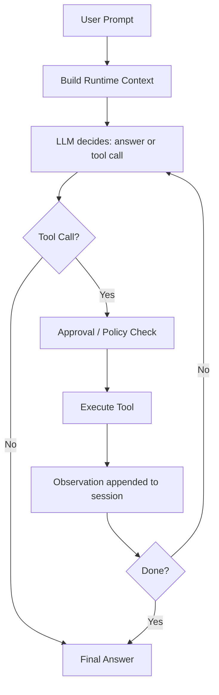
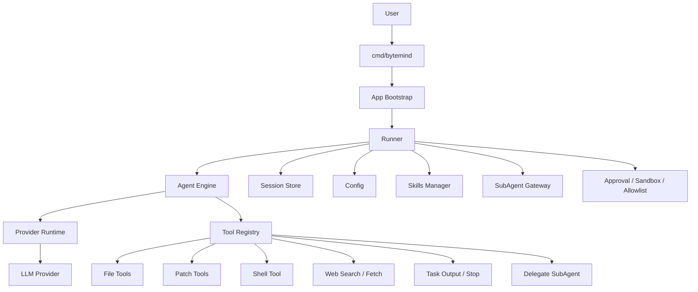

<p align="right">
  <b>English</b> | <a href="./README.zh-CN.md">简体中文</a>
</p>

<p align="center">
  
</p>

<p align="center">
  
</p>

<h1 align="center">ByteMind</h1>

<p align="center">
  <strong>A terminal-native AI coding agent for real repositories.</strong>
</p>

<p align="center">
  Let AI inspect code, search files, run commands, edit files, plan tasks, and operate under configurable human approval.
</p>

<p align="center">
  <a href="https://github.com/1024XEngineer/bytemind/stargazers"></a>
  <a href="https://github.com/1024XEngineer/bytemind/network/members"></a>
  <a href="https://github.com/1024XEngineer/bytemind/releases"></a>
  <a href="https://github.com/1024XEngineer/bytemind/blob/main/LICENSE"></a>
</p>

<p align="center">
  
  
  
  
  
</p>

<p align="center">
  <a href="https://1024xengineer.github.io/bytemind/zh/"><b>Documentation</b></a>
  ·
  <a href="#quick-start"><b>Quick Start</b></a>
  ·
  <a href="#why-bytemind"><b>Why ByteMind</b></a>
  ·
  <a href="#feature-matrix"><b>Feature Matrix</b></a>
  ·
  <a href="#architecture"><b>Architecture</b></a>
  ·
  <a href="#skills-mcp-and-subagents"><b>Skills / MCP / SubAgents</b></a>
</p>

---

## Why ByteMind

ByteMind is built for developers who want AI to work **inside the repository**, not outside it.

Instead of stopping at suggestions, ByteMind can participate in the actual engineering loop:

```text
Prompt → Plan → Tool Call → Observation → Code Change → Verification → Result
```

<p align="center">
  
  
  
</p>

<table>
  <tr>
    <td width="33%" align="center">
      <h3>🧠 Plan</h3>
      <p>Use <b>Plan mode</b> for higher-risk tasks. Review the approach before making changes.</p>
    </td>
    <td width="33%" align="center">
      <h3>🛠 Execute</h3>
      <p>Inspect files, search code, apply patches, run commands, and fetch external context when needed.</p>
    </td>
    <td width="33%" align="center">
      <h3>🧭 Control</h3>
      <p>Keep sensitive actions behind approval policies and runtime boundaries.</p>
    </td>
  </tr>
</table>

---

## Quick Start

### Install

**macOS / Linux**

```bash
curl -fsSL https://raw.githubusercontent.com/1024XEngineer/bytemind/main/scripts/install.sh | bash
```

**Windows PowerShell**

```powershell
iwr -useb https://raw.githubusercontent.com/1024XEngineer/bytemind/main/scripts/install.ps1 | iex
```

**Install a specific version**

```bash
curl -fsSL https://raw.githubusercontent.com/1024XEngineer/bytemind/main/scripts/install.sh | BYTEMIND_VERSION=vX.Y.Z bash
```

```powershell
$env:BYTEMIND_VERSION='vX.Y.Z'; iwr -useb https://raw.githubusercontent.com/1024XEngineer/bytemind/main/scripts/install.ps1 | iex
```

### Configure

```bash
mkdir -p .bytemind
cp config.example.json .bytemind/config.json
```

### Run

```bash
bytemind chat
```

```bash
bytemind run -prompt "Analyze this repository and summarize the architecture"
```

```bash
bytemind run -prompt "Refactor this module and update tests" -max-iterations 64
```

---

## Terminal Preview

```text
┌─ ByteMind ───────────────────────────────────────────────────────────────┐
│ Mode: Build | Provider: gpt-5.x | Session: active                       │
├──────────────────────────────────────────────────────────────────────────┤
│ Ask anything, or type / for commands...                                 │
│                                                                          │
│ > analyze the provider layer and suggest improvements                    │
│                                                                          │
│ Thinking…                                                                │
│ • reading files                                                          │
│ • searching symbol usage                                                 │
│ • drafting a plan                                                        │
│                                                                          │
│ Approval required                                                        │
│ Tool: write_file                                                         │
│ Command: update internal/provider/registry.go                            │
│                                                                          │
│ [Approve once] [Approve session] [Reject]                                │
└──────────────────────────────────────────────────────────────────────────┘
```

---

<a id="feature-matrix"></a>

## Feature Matrix

| Category | Capability | Notes |
| --- | --- | --- |
| **Terminal UX** | Terminal-first interaction | Built for repository-centric workflows |
| **Streaming** | Real-time output | Useful for long-running tasks |
| **Agent Loop** | Multi-step tool use + observations | More than a one-shot reply |
| **Build / Plan** | Separate planning and execution modes | Better for high-risk changes |
| **Files** | Read, search, write, replace, patch | Core repository operations |
| **Shell** | Run commands under approval | Keep execution visible and controlled |
| **Web** | Search and fetch external content | Useful when external context is needed |
| **Sessions** | Persist and resume tasks | Suitable for long-running work |
| **Skills** | Reusable workflows | Bug investigation, review, RFC, onboarding |
| **MCP** | External tool / context integration | Extend the runtime beyond local tools |
| **SubAgents** | Focused delegated work | Reduce noise in the main context |
| **Safety** | Approval, allowlists, writable roots | Human-in-the-loop execution |
| **Providers** | OpenAI-compatible / Anthropic | Configurable runtime support |

---

## Built-in Tools

```text
list_files
read_file
search_text
write_file
replace_in_file
apply_patch
run_shell
web_search
web_fetch
```

<details>
  <summary><b>What these tools enable</b></summary>

- inspect a repository structure
- locate relevant files and symbols
- update files incrementally
- apply patches instead of rewriting blindly
- run commands and verify results
- search external sources when local context is insufficient

</details>

---

## Core Experience

<table>
  <tr>
    <td width="50%">
      <h3>✅ What ByteMind is good at</h3>
      <ul>
        <li>Understanding unfamiliar repositories</li>
        <li>Debugging code and failing tests</li>
        <li>Planning and applying small refactors</li>
        <li>Reviewing correctness and regression risk</li>
        <li>Writing RFC-style implementation plans</li>
        <li>Automating repetitive coding workflows</li>
      </ul>
    </td>
    <td width="50%">
      <h3>⚙️ What makes it practical</h3>
      <ul>
        <li>Approval before sensitive actions</li>
        <li>Execution budget via <code>max_iterations</code></li>
        <li>Session persistence</li>
        <li>Provider-agnostic runtime</li>
        <li>Extensible skills and external tools</li>
        <li>SubAgent-based context isolation</li>
      </ul>
    </td>
  </tr>
</table>

---

## How It Works



---

<a id="architecture"></a>

## Architecture



---

## Configuration

Recommended project config location:

```text
.bytemind/config.json
```

### OpenAI-compatible example

```json
{
  "provider": {
    "type": "openai-compatible",
    "base_url": "https://api.openai.com/v1",
    "model": "gpt-5.4-mini",
    "api_key_env": "BYTEMIND_API_KEY"
  },
  "approval_policy": "on-request",
  "approval_mode": "interactive",
  "max_iterations": 32,
  "stream": true
}
```

### Anthropic example

```json
{
  "provider": {
    "type": "anthropic",
    "base_url": "https://api.anthropic.com",
    "model": "claude-sonnet-4-20250514",
    "api_key_env": "ANTHROPIC_API_KEY",
    "anthropic_version": "2023-06-01"
  },
  "approval_policy": "on-request",
  "approval_mode": "interactive"
}
```

<details>
  <summary><b>Runtime boundary example</b></summary>

```json
{
  "approval_policy": "on-request",
  "approval_mode": "interactive",
  "writable_roots": [],
  "exec_allowlist": [],
  "network_allowlist": [],
  "system_sandbox_mode": "off"
}
```

</details>

---

<a id="skills-mcp-and-subagents"></a>

## Skills, MCP and SubAgents

### Skills

Reusable workflows activated through slash commands.

```text
/bug-investigation    Structured bug investigation
/review               Correctness, regression risk, and test coverage review
/repo-onboarding      Understand an unfamiliar repository
/write-rfc            Generate a structured technical proposal
/skill-creator        Create, refine, and evaluate skills
```

### MCP

Use MCP to connect ByteMind to external tools and context beyond local repository operations.

### SubAgents

SubAgents provide isolated execution contexts for focused work:

- broad repository discovery
- file targeting
- read-only exploration
- bug scope reduction
- review / analysis subtasks

<p align="center">
  
  
  
</p>

---

## Safety Model

| Action | Typical behavior |
| --- | --- |
| Read files | Usually allowed automatically |
| Search files | Usually allowed automatically |
| Write files | Requires approval |
| Run shell commands | Requires approval or allowlist |
| High-risk actions | Shown before execution |

> ByteMind is designed around a simple principle:<br>
> **AI can execute, but humans should keep the final control boundary.**

---

## Project Structure

```text
cmd/bytemind            CLI entrypoint
internal/app            Application bootstrap
internal/agent          Agent loop, prompts, streaming, subagent execution
internal/config         Config loading, defaults, environment overrides
internal/llm            Common message and tool types
internal/provider       Provider adapters and provider runtime
internal/session        Session persistence
internal/tools          File / patch / shell / web tools
internal/skills         Skills discovery and loading
internal/subagents      SubAgent manager and preflight gateway
internal/sandbox        Runtime boundary and sandbox-related logic
```

---

## Use Cases

- understand a new codebase
- debug failing tests
- review or refine changes
- generate technical plans and RFCs
- automate repeated engineering tasks
- work with explicit human approval on sensitive actions

---

## Roadmap

- [ ] Expand built-in skills
- [ ] Improve MCP integration and examples
- [ ] Improve SubAgent workflows
- [ ] Strengthen TUI interaction
- [ ] Add richer audit and sandbox controls
- [ ] Support team-shared workflow assets

---

## Links

- Documentation: <https://1024xengineer.github.io/bytemind/zh/>
- GitHub: <https://github.com/1024XEngineer/bytemind>

---

## License

This project is licensed under the [MIT License](LICENSE).
