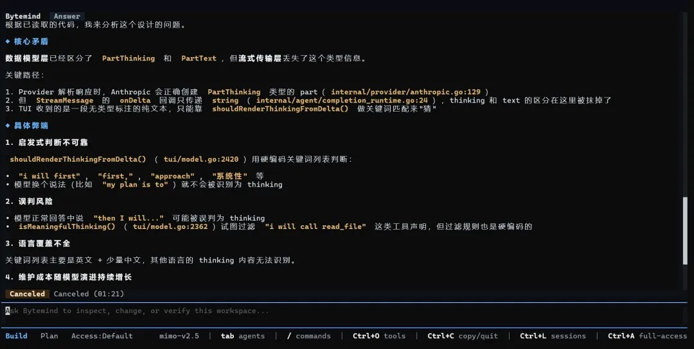
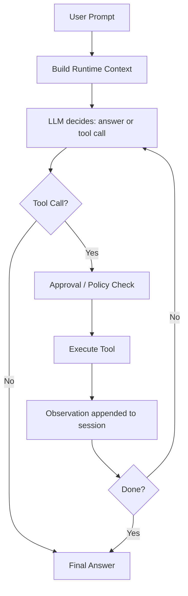
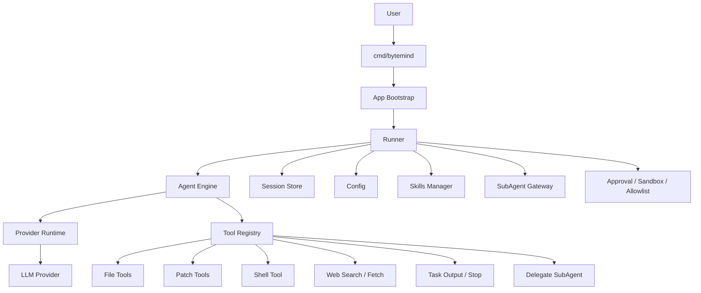

<p align="right">
  <b>English</b> | <a href="./README.zh-CN.md">简体中文</a>
</p>

<p align="center">
  
</p>

<p align="center">
  
</p>

<h1 align="center">ByteMind</h1>

<p align="center">
  <strong>A terminal-native AI coding agent for real repositories.</strong>
</p>

<p align="center">
  Let AI inspect code, search files, run commands, edit files, plan tasks, and operate under configurable human approval.
</p>

<p align="center">
  <a href="https://github.com/1024XEngineer/bytemind/stargazers"></a>
  <a href="https://github.com/1024XEngineer/bytemind/network/members"></a>
  <a href="https://github.com/1024XEngineer/bytemind/releases"></a>
  <a href="https://github.com/1024XEngineer/bytemind/blob/main/LICENSE"></a>
</p>

<p align="center">
  
  
  
  
  
  <a href="https://github.com/1024XEngineer/bytemind/actions"></a>
  <a href="./evals/README.md"></a>
  <a href="./DEMO.md"></a>
  <a href="https://codecov.io/gh/1024XEngineer/bytemind"></a>
</p>

<p align="center">
  <a href="https://1024xengineer.github.io/bytemind/zh/"><b>Documentation</b></a>
  ·
  <a href="#why-bytemind"><b>Why ByteMind</b></a>
  ·
  <a href="#use-cases"><b>Use Cases</b></a>
  ·
  <a href="#quick-start"><b>Quick Start</b></a>
  ·
  <a href="#feature-matrix"><b>Feature Matrix</b></a>
  ·
  <a href="#architecture"><b>Architecture</b></a>
  ·
  <a href="#skills-mcp-and-subagents"><b>Skills / MCP / SubAgents</b></a>
</p>

---

## Why ByteMind

ByteMind is built for developers who want AI to work **inside the repository**, not outside it.

Instead of stopping at suggestions, ByteMind can participate in the actual engineering loop:

```text
Prompt → Plan → Tool Call → Observation → Code Change → Verification → Result
```

<p align="center">
  
  
  
</p>

<table>
  <tr>
    <td width="33%" align="center">
      <h3>🧠 Plan</h3>
      <p>Use <b>Plan mode</b> for higher-risk tasks. Review the approach before making changes.</p>
    </td>
    <td width="33%" align="center">
      <h3>🛠 Execute</h3>
      <p>Inspect files, search code, apply patches, run commands, and fetch external context when needed.</p>
    </td>
    <td width="33%" align="center">
      <h3>🧭 Control</h3>
      <p>Keep sensitive actions behind approval policies and runtime boundaries.</p>
    </td>
  </tr>
</table>

---

## Use Cases

| Scenario | What ByteMind can do |
| --- | --- |
| Understand a new repository | Inspect structure, find entrypoints, and map key modules and call paths |
| Debug failing tests | Read failures, locate related code, patch the issue, and verify again |
| Review or refine changes | Check correctness, regression risk, and missing test coverage |
| Generate technical plans and RFCs | Turn repository context into an actionable implementation proposal |
| Automate repeated engineering tasks | Encode common workflows through Skills, MCP, or SubAgents |
| Collaborate under approval | Read and write files, run commands, and advance tasks while preserving approval boundaries |

---

## Quick Start

### Install

**macOS / Linux**

```bash
curl -fsSL https://raw.githubusercontent.com/1024XEngineer/bytemind/main/scripts/install.sh | bash
```

**Windows PowerShell**

```powershell
iwr -useb https://raw.githubusercontent.com/1024XEngineer/bytemind/main/scripts/install.ps1 | iex
```

**Install a specific version**

```bash
curl -fsSL https://raw.githubusercontent.com/1024XEngineer/bytemind/main/scripts/install.sh | BYTEMIND_VERSION=vX.Y.Z bash
```

```powershell
$env:BYTEMIND_VERSION='vX.Y.Z'; iwr -useb https://raw.githubusercontent.com/1024XEngineer/bytemind/main/scripts/install.ps1 | iex
```

### Configure

```bash
mkdir -p .bytemind
cp config.example.json .bytemind/config.json
```

### Run

```bash
bytemind chat
```

```bash
bytemind run -prompt "Analyze this repository and summarize the architecture"
```

```bash
bytemind run -prompt "Refactor this module and update tests" -max-iterations 64
```

---

## 5-Minute Demo

A reproducible bug-fix cycle that demonstrates ByteMind's full engineering loop:

```bash
go run ./cmd/bytemind run \
  -prompt "Fix the failing test and verify it passes" \
  -workspace examples/bugfix-demo/broken-project \
  -approval-mode full_access
```

| Step | Tool | What happens |
|------|------|-------------|
| 1 | `list_files` | Reads project structure |
| 2 | `read_file` | Reads source code and test file |
| 3 | `run_tests` | Discovers the failing test |
| 4 | `replace_in_file` | Fixes the divide-by-zero bug |
| 5 | `run_tests` | Verifies all tests pass |
| 6 | `git_diff` | Shows the exact change made |

**The bug**: `CalculateAverage` returns `NaN` on empty slice (divide by zero).  
**The fix**: Add a guard clause for `len(nums) == 0`.  

**Offline verification** (no API key needed):
```bash
go run ./evals/runner.go -smoke -run bugfix_go_001
```

See [examples/bugfix-demo/](examples/bugfix-demo/README.md) for details, [DEMO.md](DEMO.md) for a judge-facing walkthrough, and [ENGINEERING.md](ENGINEERING.md) for engineering evidence.

---

## Engineering Evidence

ByteMind is built for evaluators who need reproducible, verifiable engineering output.

### Real Agent Loop
Multi-step tool use with observation feedback, context compaction, rate-limit retry, and execution budgets (`internal/agent/engine_run_loop.go`).

### Coding-native Tools
14 built-in tools with JSON-structured output — `git_status`, `git_diff`, `run_tests`, file read/search/write/patch, shell execution, and web access. Each tool has unit tests and a safety classification.

### Reproducible Demo
`examples/bugfix-demo/broken-project` is a self-contained Go project that fails `go test ./...` initially and passes after agent fix. Complete with expected output and offline verification.

### Evaluation System
YAML-defined eval tasks run via `evals/runner.go` with flexible success criteria: command exit codes, output patterns, file content regex, and file modification detection. CI-integrated with `-validate` and `-smoke` flags.

### Safety Boundary
Three-layer safety model: approval policy (`on-request`/`always`/`never`), sandbox (`off`/`best_effort`/`required`), and runtime boundaries (writable roots, exec allowlist, network allowlist). See `bytemind safety explain`.

### CI and Testing
PR-gated CI: `go build ./...`, unit tests with coverage, sandbox acceptance on Linux/macOS/Windows, and eval smoke checks. See [`.github/workflows/ci.yml`](.github/workflows/ci.yml).

### Extensibility
Skills, MCP servers, and SubAgents for encoding reusable workflows and delegating focused work.

---

## Terminal Preview

<p align="center">
  
</p>

---

<a id="feature-matrix"></a>

## Feature Matrix

| Category | Capability | Notes |
| --- | --- | --- |
| **Terminal UX** | Terminal-first interaction | Built for repository-centric workflows |
| **Streaming** | Real-time output | Useful for long-running tasks |
| **Agent Loop** | Multi-step tool use + observations | More than a one-shot reply |
| **Build / Plan** | Separate planning and execution modes | Better for high-risk changes |
| **Files** | Read, search, write, replace, patch | Core repository operations |
| **Git** | `git_status`, `git_diff` | Show working tree status and changes |
| **Testing** | `run_tests` | Auto-detect and run project tests |
| **Shell** | Run commands under approval | Keep execution visible and controlled |
| **Web** | Search and fetch external content | Useful when external context is needed |
| **Sessions** | Persist and resume tasks | Suitable for long-running work |
| **Skills** | Reusable workflows | Bug investigation, review, RFC, onboarding |
| **MCP** | External tool / context integration | Extend the runtime beyond local tools |
| **SubAgents** | Focused delegated work | Reduce noise in the main context |
| **Safety** | Approval, allowlists, writable roots | Human-in-the-loop execution |
| **Providers** | OpenAI-compatible / Anthropic | Configurable runtime support |

---

## Built-in Tools

| Tool | Purpose |
| --- | --- |
| `list_files` | Inspect repository structure and candidate file scopes |
| `read_file` | Read source code, docs, config, and test content |
| `search_text` | Locate symbols, error messages, or call sites by keyword |
| `git_status` | Show the working tree status (staged, unstaged, untracked) |
| `git_diff` | Output a unified diff of the current changes |
| `run_tests` | Auto-detect and run project tests, return results |
| `write_file` | Create or fully rewrite files |
| `replace_in_file` | Make small text replacements in existing files |
| `apply_patch` | Apply incremental file changes through patches |
| `run_shell` | Run commands inside the approval boundary and read results |
| `web_search` | Search external sources when local context is insufficient |
| `web_fetch` | Fetch a specific page as supplemental context |

---

## Core Experience

<table>
  <tr>
    <td width="50%">
      <h3>✅ What ByteMind is good at</h3>
      <ul>
        <li>Understanding unfamiliar repositories</li>
        <li>Debugging code and failing tests</li>
        <li>Planning and applying small refactors</li>
        <li>Reviewing correctness and regression risk</li>
        <li>Writing RFC-style implementation plans</li>
        <li>Automating repetitive coding workflows</li>
      </ul>
    </td>
    <td width="50%">
      <h3>⚙️ What makes it practical</h3>
      <ul>
        <li>Approval before sensitive actions</li>
        <li>Execution budget via <code>max_iterations</code></li>
        <li>Session persistence</li>
        <li>Provider-agnostic runtime</li>
        <li>Extensible skills and external tools</li>
        <li>SubAgent-based context isolation</li>
      </ul>
    </td>
  </tr>
</table>

---

## How It Works



---

<a id="architecture"></a>

## Architecture



---

## Configuration

ByteMind normally merges three configuration layers: built-in defaults, user-level `~/.bytemind/config.json` (or `BYTEMIND_HOME/config.json`), and project-level `<workspace>/.bytemind/config.json`.

The example below is a **project-level config** and only affects the current workspace. Provider credentials reused across repositories usually belong in user-level config or environment variables. Passing `-config` uses that explicit config file.

```text
.bytemind/config.json
```

### OpenAI-compatible example

```json
{
  "provider": {
    "type": "openai-compatible",
    "base_url": "https://api.openai.com/v1",
    "model": "gpt-5.4-mini",
    "api_key_env": "BYTEMIND_API_KEY"
  },
  "approval_policy": "on-request",
  "approval_mode": "interactive",
  "max_iterations": 32,
  "stream": true
}
```

### Anthropic example

```json
{
  "provider": {
    "type": "anthropic",
    "base_url": "https://api.anthropic.com",
    "model": "claude-sonnet-4-20250514",
    "api_key_env": "ANTHROPIC_API_KEY",
    "anthropic_version": "2023-06-01"
  },
  "approval_policy": "on-request",
  "approval_mode": "interactive"
}
```

<details>
  <summary><b>Runtime boundary example</b></summary>

```json
{
  "approval_policy": "on-request",
  "approval_mode": "interactive",
  "writable_roots": [],
  "exec_allowlist": [],
  "network_allowlist": [],
  "system_sandbox_mode": "off"
}
```

</details>

---

<a id="skills-mcp-and-subagents"></a>

## Skills, MCP and SubAgents

### Skills

Reusable workflow definitions loaded from three scopes (builtin > user > project). Each skill has a slash entry, tool policy, and instruction file. Use the `/skills` and `/skill` commands to list, activate, and manage skills.

```text
/help                 Show available commands
/session              Show the current session
/sessions [limit]     List recent sessions
/agents [name]        List available subagents or show one definition
/explorer             Show the builtin explorer subagent definition
/review               Show the builtin review subagent definition
/resume <id>          Resume a recent session by id or prefix
/new                  Start a new session in the current workspace
/quit                 Exit the CLI
```

Built-in skills include bug investigation, GitHub PR review, repository onboarding, code review, RFC writing, and skill creation.

### MCP

Use MCP to connect ByteMind to external tools and context beyond local repository operations.

### SubAgents

SubAgents provide isolated execution contexts for focused work:

| SubAgent | Tools | Purpose |
|----------|-------|---------|
| `explorer` | `list_files`, `read_file`, `search_text` | Read-only repository exploration |
| `review` | `list_files`, `read_file`, `search_text` | Code review and bug detection |
| `general` | File tools + edit tools | Multi-step coding tasks |

<p align="center">
  
  
  
</p>

---

## Safety Model

| Action | Typical behavior |
| --- | --- |
| Read files | Usually allowed automatically |
| Search files | Usually allowed automatically |
| Write files | Requires approval |
| Run shell commands | Requires approval or allowlist |
| High-risk actions | Shown before execution |

> ByteMind is designed around a simple principle:<br>
> **AI can execute, but humans should keep the final control boundary.**

### Safety diagnostics

```bash
# View current safety configuration
bytemind safety status

# Understand the safety model
bytemind safety explain

# Check environment, config, and dependencies
bytemind doctor
```

---

## Project Structure

```text
cmd/bytemind            CLI entrypoint (chat / run / doctor / safety / mcp)
internal/app            Application bootstrap and CLI dispatch
internal/agent          Agent loop, prompts, streaming, subagent execution
internal/config         Config loading, defaults, environment overrides
internal/llm            Common message and tool types
internal/provider       Provider adapters and provider runtime
internal/session        Session persistence
internal/tools          Tool registry and 14 built-in tools
internal/skills         Skills discovery and loading
internal/subagents      SubAgent manager and preflight gateway
internal/sandbox        Runtime boundary and sandbox-related logic
tui/                    Terminal UI (BubbleTea framework)
examples/bugfix-demo    5-minute reproducible bug-fix demo
evals/                  Evaluation tasks and runner
docs/                   Architecture docs, RFCs, PRDs
scripts/                Cross-platform install scripts
```

---

## Links

- Documentation: <https://1024xengineer.github.io/bytemind/zh/>
- GitHub: <https://github.com/1024XEngineer/bytemind>

---

## License

This project is licensed under the [MIT License](LICENSE).
