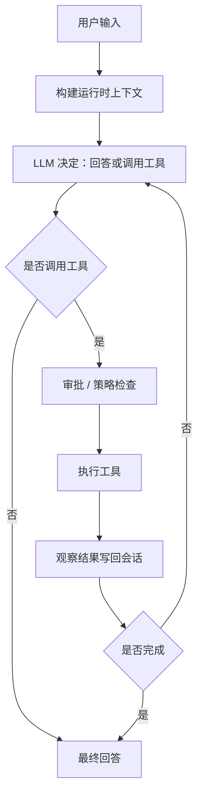
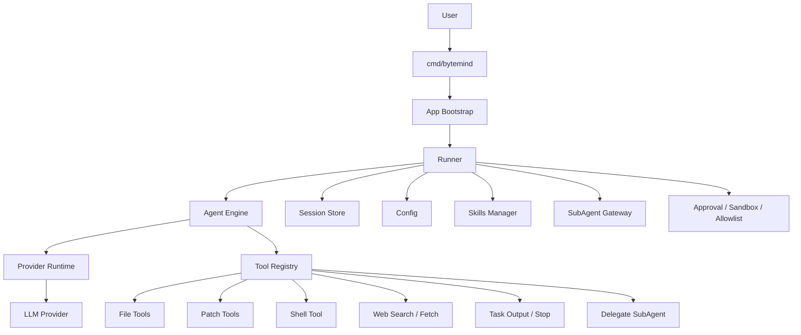

<p align="right">
  <a href="./README.md">English</a> | <b>简体中文</b>
</p>

<p align="center">
  
</p>

<p align="center">
  
</p>

<h1 align="center">ByteMind</h1>

<p align="center">
  <strong>面向真实代码仓库的终端原生 AI Coding Agent。</strong>
</p>

<p align="center">
  让 AI 在终端中读代码、搜文件、执行命令、修改代码、规划任务，并在关键操作前保持可控审批。
</p>

<p align="center">
  <a href="https://github.com/1024XEngineer/bytemind/stargazers"></a>
  <a href="https://github.com/1024XEngineer/bytemind/network/members"></a>
  <a href="https://github.com/1024XEngineer/bytemind/releases"></a>
  <a href="https://github.com/1024XEngineer/bytemind/blob/main/LICENSE"></a>
</p>

<p align="center">
  
  
  
  
  
  <a href="https://github.com/1024XEngineer/bytemind/actions"></a>
  <a href="./evals/README.md"></a>
</p>

<p align="center">
  <a href="https://1024xengineer.github.io/bytemind/zh/"><b>文档</b></a>
  ·
  <a href="#为什么是-bytemind"><b>为什么是 ByteMind</b></a>
  ·
  <a href="#使用场景"><b>使用场景</b></a>
  ·
  <a href="#快速开始"><b>快速开始</b></a>
  ·
  <a href="#功能矩阵"><b>功能矩阵</b></a>
  ·
  <a href="#架构"><b>架构</b></a>
  ·
  <a href="#skillsmcp-与-subagents"><b>Skills / MCP / SubAgents</b></a>
</p>

---

<a id="为什么是-bytemind"></a>

## 为什么是 ByteMind

ByteMind 面向的是这样一类开发者：希望 AI **直接在代码仓库内部工作**，而不是停留在外部聊天窗口中。

它不只给建议，而是尝试进入真实工程闭环：

```text
需求输入 → 制定计划 → 调用工具 → 观察结果 → 修改代码 → 执行验证 → 输出结果
```

<p align="center">
  
  
  
</p>

<table>
  <tr>
    <td width="33%" align="center">
      <h3>🧠 先规划</h3>
      <p>对于高风险任务，可以先进入 <b>Plan 模式</b>，先审阅方案，再决定是否执行。</p>
    </td>
    <td width="33%" align="center">
      <h3>🛠 再执行</h3>
      <p>检查文件、搜索代码、应用补丁、执行命令，并在需要时获取外部上下文。</p>
    </td>
    <td width="33%" align="center">
      <h3>🧭 保持控制</h3>
      <p>通过审批策略和运行边界，让关键动作始终处于可见、可控的范围内。</p>
    </td>
  </tr>
</table>

---

<a id="使用场景"></a>

## 使用场景

| 场景 | ByteMind 可以做什么 |
| --- | --- |
| 理解新代码仓库 | 浏览目录、定位入口、梳理关键模块和调用链 |
| 排查失败测试 | 读取失败信息、定位相关代码、修改后再次验证 |
| 审查或优化改动 | 从正确性、回归风险和测试覆盖角度检查变更 |
| 生成技术方案和 RFC | 基于仓库上下文生成可执行的实现方案 |
| 自动化重复工程任务 | 把常见流程沉淀为 Skills、MCP 或 SubAgent 工作流 |
| 协作编码 | 在保留审批边界的前提下读写文件、执行命令、推进任务 |

---

<a id="快速开始"></a>

## 快速开始

### 安装

**macOS / Linux**

```bash
curl -fsSL https://raw.githubusercontent.com/1024XEngineer/bytemind/main/scripts/install.sh | bash
```

**Windows PowerShell**

```powershell
iwr -useb https://raw.githubusercontent.com/1024XEngineer/bytemind/main/scripts/install.ps1 | iex
```

**安装指定版本**

```bash
curl -fsSL https://raw.githubusercontent.com/1024XEngineer/bytemind/main/scripts/install.sh | BYTEMIND_VERSION=vX.Y.Z bash
```

```powershell
$env:BYTEMIND_VERSION='vX.Y.Z'; iwr -useb https://raw.githubusercontent.com/1024XEngineer/bytemind/main/scripts/install.ps1 | iex
```

### 配置

```bash
mkdir -p .bytemind
cp config.example.json .bytemind/config.json
```

### 运行

```bash
bytemind chat
```

```bash
bytemind run -prompt "分析当前仓库并总结架构"
```

```bash
bytemind run -prompt "重构这个模块并更新测试" -max-iterations 64
```

---

## 5 分钟演示

一个可复现的 Bug 修复闭环，展示 ByteMind 的完整工程能力：

```bash
go run ./cmd/bytemind run \
  -prompt "修复失败的测试并验证它通过" \
  -workspace examples/bugfix-demo/broken-project \
  -approval-mode full_access
```

| 步骤 | 工具 | 内容 |
|------|------|------|
| 1 | `list_files` | 读取项目结构 |
| 2 | `read_file` | 读取源码和测试文件 |
| 3 | `run_tests` | 发现失败的测试 |
| 4 | `replace_in_file` | 修复除零 Bug |
| 5 | `run_tests` | 验证所有测试通过 |
| 6 | `git_diff` | 展示精确的修改内容 |

**Bug**: `CalculateAverage` 在空切片上除零崩溃。  
**修复**: 添加 `len(nums) == 0` 守卫条件。  
详见 [examples/bugfix-demo/](examples/bugfix-demo/README.md)。

---

## 终端预览

<p align="center">
  
</p>

---

<a id="功能矩阵"></a>

## 功能矩阵

| 分类 | 能力 | 说明 |
| --- | --- | --- |
| **终端体验** | 终端优先交互 | 面向真实仓库工作流 |
| **流式输出** | 实时观察执行过程 | 适合长任务 |
| **Agent Loop** | 多步骤工具调用 + 观察结果 | 不只是一次性问答 |
| **Build / Plan** | 规划与执行分离 | 更适合高风险改动 |
| **文件能力** | 读取、搜索、写入、替换、补丁 | 核心仓库操作 |
| **Git 能力** | `git_status`, `git_diff` | 查看工作区状态和变更 |
| **测试能力** | `run_tests` | 自动检测并运行项目测试 |
| **Shell** | 在审批下执行命令 | 让执行过程可控 |
| **Web** | 搜索和抓取外部内容 | 需要外部上下文时使用 |
| **会话管理** | 持久化和恢复任务 | 适合长期工作 |
| **Skills** | 可复用工作流 | Bug 排查、审查、RFC、onboarding |
| **MCP** | 外部工具 / 上下文集成 | 让运行时能力更丰富 |
| **SubAgents** | 聚焦型委托执行 | 降低主上下文噪声 |
| **安全控制** | 审批、allowlist、可写目录 | 人类在环执行 |
| **Provider** | OpenAI-compatible / Anthropic | 可配置运行时支持 |

---

## 内置工具

| 工具 | 用途 |
| --- | --- |
| `list_files` | 检查仓库结构和候选文件范围 |
| `read_file` | 读取源码、文档、配置和测试内容 |
| `search_text` | 按关键词定位符号、错误信息或调用点 |
| `git_status` | 查看工作区状态（暂存、未暂存、未跟踪） |
| `git_diff` | 输出当前变更的 unified diff |
| `run_tests` | 自动检测并运行项目测试，返回结果 |
| `write_file` | 创建或完整写入文件 |
| `replace_in_file` | 对已有文件做小范围文本替换 |
| `apply_patch` | 以补丁方式增量修改文件 |
| `run_shell` | 在审批边界内执行命令并读取结果 |
| `web_search` | 本地上下文不足时搜索外部资料 |
| `web_fetch` | 抓取指定页面内容作为补充上下文 |

---

## 核心体验

<table>
  <tr>
    <td width="50%">
      <h3>✅ ByteMind 擅长的事情</h3>
      <ul>
        <li>理解陌生代码仓库</li>
        <li>排查代码与失败测试</li>
        <li>规划并执行小范围重构</li>
        <li>审查正确性与回归风险</li>
        <li>撰写 RFC 风格实现方案</li>
        <li>自动化重复工程工作流</li>
      </ul>
    </td>
    <td width="50%">
      <h3>⚙️ 它为什么实用</h3>
      <ul>
        <li>敏感动作先审批</li>
        <li>通过 <code>max_iterations</code> 控制执行预算</li>
        <li>支持会话持久化</li>
        <li>Provider 无关运行时</li>
        <li>可扩展 Skills 与外部工具</li>
        <li>基于 SubAgent 的上下文隔离</li>
      </ul>
    </td>
  </tr>
</table>

---

## 工作原理



---

<a id="架构"></a>

## 架构



---

## 配置

ByteMind 默认合并三层配置：内置默认值、用户级 `~/.bytemind/config.json`（或 `BYTEMIND_HOME/config.json`）和项目级 `<workspace>/.bytemind/config.json`。

下方示例是**项目级配置**，只影响当前工作区；跨仓库复用的 provider 凭证更适合放在用户级配置或环境变量中。显式传入 `-config` 时，会使用指定配置文件。

```text
.bytemind/config.json
```

### OpenAI-compatible 示例

```json
{
  "provider": {
    "type": "openai-compatible",
    "base_url": "https://api.openai.com/v1",
    "model": "gpt-5.4-mini",
    "api_key_env": "BYTEMIND_API_KEY"
  },
  "approval_policy": "on-request",
  "approval_mode": "interactive",
  "max_iterations": 32,
  "stream": true
}
```

### Anthropic 示例

```json
{
  "provider": {
    "type": "anthropic",
    "base_url": "https://api.anthropic.com",
    "model": "claude-sonnet-4-20250514",
    "api_key_env": "ANTHROPIC_API_KEY",
    "anthropic_version": "2023-06-01"
  },
  "approval_policy": "on-request",
  "approval_mode": "interactive"
}
```

<details>
  <summary><b>运行边界示例</b></summary>

```json
{
  "approval_policy": "on-request",
  "approval_mode": "interactive",
  "writable_roots": [],
  "exec_allowlist": [],
  "network_allowlist": [],
  "system_sandbox_mode": "off"
}
```

</details>

---

<a id="skillsmcp-与-subagents"></a>

## Skills、MCP 与 SubAgents

### Skills

可复用工作流定义，从三个作用域加载（builtin > user > project）。每个 Skill 有斜杠入口、工具策略和指令文件。

```text
/skills              列出可用 Skills 和诊断信息
/skill clear         清除当前会话的活跃 Skill
/skill delete <name> 删除项目 Skill
/<skill-name>        按名称激活 Skill（如 /bug-investigation）
```

### MCP

MCP 用于把 ByteMind 连接到本地仓库之外的外部工具和上下文。

### SubAgents

SubAgents 提供聚焦型隔离执行上下文：

| SubAgent | 工具 | 用途 |
|----------|------|------|
| `explorer` | `list_files`, `read_file`, `search_text` | 只读仓库探索 |
| `review` | `list_files`, `read_file`, `search_text` | 代码审查和 Bug 检测 |
| `general` | 文件工具 + 编辑工具 | 多步骤编码任务 |

<p align="center">
  
  
  
</p>

---

## 安全模型

| 动作 | 默认行为 |
| --- | --- |
| 读取文件 | 通常自动允许 |
| 搜索文件 | 通常自动允许 |
| 写入文件 | 需要审批 |
| 执行 shell 命令 | 需要审批或受 allowlist 约束 |
| 高风险动作 | 执行前展示确认 |

> ByteMind 的设计原则很简单：<br>
> **AI 可以执行，但最终控制边界必须掌握在人手里。**

### 安全诊断

```bash
# 查看当前安全配置
bytemind safety status

# 了解安全模型
bytemind safety explain

# 检查环境、配置和依赖
bytemind doctor
```

---

## 项目结构

```text
cmd/bytemind            CLI 入口
internal/app            应用启动装配
internal/agent          Agent loop、prompt、streaming、subagent execution
internal/config         配置加载、默认值、环境变量覆盖
internal/llm            通用消息与工具类型
internal/provider       Provider 适配与 provider runtime
internal/session        会话持久化
internal/tools          文件 / patch / shell / web 工具
internal/skills         Skills 发现与加载
internal/subagents      SubAgent 管理与 preflight gateway
internal/sandbox        运行边界与沙箱相关逻辑
tui/                    终端 UI（BubbleTea 框架）
examples/bugfix-demo    5 分钟可复现 Bug 修复演示
evals/                  评测任务与运行器
docs/                   架构文档、RFC、PRD
scripts/                跨平台安装脚本
```

---

## 链接

- 文档：<https://1024xengineer.github.io/bytemind/zh/>
- GitHub：<https://github.com/1024XEngineer/bytemind>

---

## License

This project is licensed under the [MIT License](LICENSE).
