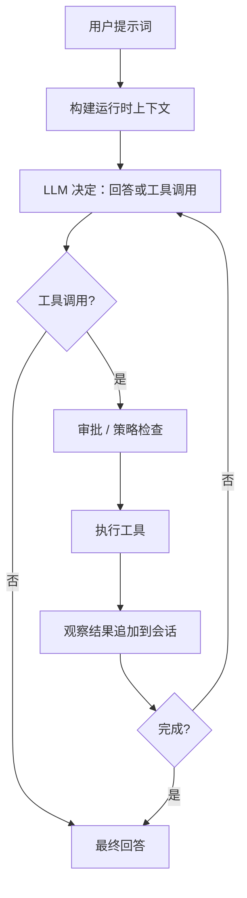

# ByteMind

> 面向真实代码仓库的终端原生 AI Coding Agent。

让 AI 在终端中读代码、搜文件、执行命令、修改代码、规划任务，并在关键操作前保持可控审批。

<p align="center">

[](https://github.com/1024XEngineer/bytemind/actions)
[](./evals/README.md)
[](./DEMO.md)
[](https://codecov.io/gh/1024XEngineer/bytemind)
[](https://go.dev)
[]()

</p>

---

## 5 分钟 Demo

可复现的 bug 修复流程，展示 ByteMind 的完整工程循环 — 检查、诊断、修改、验证。

```bash
go run ./cmd/bytemind run \
  -prompt "Fix the failing test and verify it passes" \
  -workspace examples/bugfix-demo/broken-project \
  -approval-mode full_access
```

**Bug**: `CalculateAverage` 在空 slice 上返回 `NaN`（除零错误）。
**修复**: 添加 `len(nums) == 0` 守卫条件。

| 步骤 | 工具 | 操作 |
|------|------|------|
| 1 | `list_files` | 读取项目结构 |
| 2 | `read_file` | 读取源代码和测试文件 |
| 3 | `run_tests` | 发现失败的测试 |
| 4 | `replace_in_file` | 修复除零 bug |
| 5 | `run_tests` | 验证所有测试通过 |
| 6 | `git_diff` | 显示精确的修改 diff |

**离线验证**（无需 API key）:

```bash
go run ./evals/runner.go -smoke -run bugfix_go_001
```

详见 [examples/bugfix-demo/](examples/bugfix-demo/README.md) 和 [DEMO.md](DEMO.md)。

---

## 工程证据

ByteMind 专为需要可复现、可验证工程输出的评估场景而设计。

### 真实 Agent 循环

多步工具调用 + 观测反馈、上下文压缩、限流重试、执行预算控制（`internal/agent/engine_run_loop.go`）。

### 编码原生工具

14 个内置工具覆盖仓库操作全链路 — `git_status`、`git_diff`、`run_tests`、文件读写搜索、补丁应用、Shell 执行和 Web 访问。每个工具都有单元测试和安全分类。

### 可复现 Demo

`examples/bugfix-demo/broken-project` 是一个自包含的 Go 项目，初始 `go test ./...` 失败，Agent 修复后通过。提供预期输出和离线验证。

### 评估系统

YAML 定义的评估任务，通过 `evals/runner.go` 运行，支持灵活的成功条件：命令退出码、输出模式、文件内容正则、文件修改检测。

### 安全边界

三层安全模型：审批策略（`on-request`/`always`/`never`）、沙箱（off/best-effort/required）、运行时边界（可写目录、执行白名单、网络白名单）。详见 `bytemind safety explain`。

### CI 与测试

PR 门禁 CI：`go build ./...`、单元测试 + 覆盖率、Linux/macOS/Windows 沙箱验收、评估冒烟检查。

### 可扩展性

Skills（可复用工作流）、MCP（外部工具集成）、SubAgents（聚焦委派）。

详见 [ENGINEERING.md](ENGINEERING.md)。

---

## 快速开始

### 安装

**macOS / Linux**
```bash
curl -fsSL https://raw.githubusercontent.com/1024XEngineer/bytemind/main/scripts/install.sh | bash
```

**Windows PowerShell**
```powershell
iwr -useb https://raw.githubusercontent.com/1024XEngineer/bytemind/main/scripts/install.ps1 | iex
```

### 配置
```bash
mkdir -p .bytemind
cp config.example.json .bytemind/config.json
```

### 运行
```bash
# 交互式会话
bytemind chat

# 一次性分析
bytemind run -prompt "分析此仓库并总结架构"

# 多步任务
bytemind run -prompt "重构此模块并更新测试" -max-iterations 64
```

---

## 内置工具

| 工具 | 用途 |
| --- | --- |
| `list_files` | 检查仓库结构和文件范围 |
| `read_file` | 读取源代码、文档、配置和测试内容 |
| `search_text` | 按关键字定位符号、错误消息或调用点 |
| `git_status` | 显示工作树状态（暂存、未暂存、未跟踪） |
| `git_diff` | 输出当前更改的统一 diff |
| `run_tests` | 自动检测并运行项目测试，返回结果 |
| `write_file` | 创建或完全重写文件 |
| `replace_in_file` | 对现有文件进行小文本替换 |
| `apply_patch` | 通过补丁应用增量文件更改 |
| `run_shell` | 在审批边界内运行命令并读取结果 |
| `web_search` | 本地上下文不足时搜索外部资源 |
| `web_fetch` | 获取特定页面作为补充上下文 |

---

## 功能矩阵

| 类别 | 能力 | 说明 |
| --- | --- | --- |
| **终端 UX** | 终端优先交互 | 为仓库中心化工作流构建 |
| **流式输出** | 实时输出 | 适用于长时间运行任务 |
| **Agent 循环** | 多步工具使用 + 观测 | 超越一次性回复 |
| **构建 / 计划** | 独立的计划和执行模式 | 适用于高风险更改 |
| **文件** | 读、搜索、写、替换、补丁 | 核心仓库操作 |
| **Git** | `git_status`, `git_diff` | 显示工作树状态和更改 |
| **测试** | `run_tests` | 自动检测并运行项目测试 |
| **Shell** | 在审批下运行命令 | 保持执行可见和可控 |
| **Web** | 搜索和获取外部内容 | 需要外部上下文时有用 |
| **会话** | 持久化和恢复任务 | 适用于长时间工作 |
| **Skills** | 可复用工作流 | bug 调查、审查、RFC、入门 |
| **MCP** | 外部工具 / 上下文集成 | 扩展运行时能力 |
| **SubAgents** | 聚焦委派工作 | 减少主上下文噪音 |
| **安全** | 审批、白名单、可写根目录 | 人在回路的执行 |
| **Provider** | OpenAI 兼容 / Anthropic / Gemini / Mock | 可配置的运行时支持 |

---

## 工作原理



---

## 安全模型

ByteMind 使用分层安全架构：

| 层 | 默认 | 描述 |
|-------|---------|-------------|
| 工具安全分类 | 读取自动批准 | 每个工具有安全分类（安全/中等/敏感/破坏性） |
| 审批策略 | `on-request` | 高风险工具提示审批 |
| 审批模式 | `interactive` | 用户在 TUI 中看到审批提示 |
| 沙箱 | `off` | 可选的运行时边界 |
| 可写根目录 | 仅 workspace | 限制文件写入到允许的目录 |
| 执行白名单 | 受限 | 已知安全命令自动批准 |

```bash
# 查看当前安全配置
bytemind safety status

# 了解安全模型
bytemind safety explain

# 检查环境、配置和依赖
bytemind doctor
```

---

## 项目结构

```text
cmd/bytemind            CLI 入口点（chat / run / doctor / safety / mcp）
internal/app            应用引导和 CLI 调度
internal/agent          Agent 循环、提示、流式、子代理执行
internal/config         配置加载、默认值、环境覆盖
internal/llm            通用消息和工具类型
internal/provider       Provider 适配器和运行时
internal/session        会话持久化
internal/tools          工具注册表和 14 个内置工具
internal/skills         Skills 发现和加载
internal/subagents      子代理管理和网关
internal/sandbox        运行时边界和沙箱逻辑
tui/                    终端 UI（BubbleTea 框架）
examples/bugfix-demo    5 分钟可复现 bug 修复演示
evals/                  评估任务和运行器
docs/                   架构文档、RFC、PRD
scripts/                跨平台安装脚本
```

---

## 链接

- **文档**: <https://1024xengineer.github.io/bytemind/zh/>
- **GitHub**: <https://github.com/1024XEngineer/bytemind>

<p align="right"><a href="./README.md">English</a></p>
