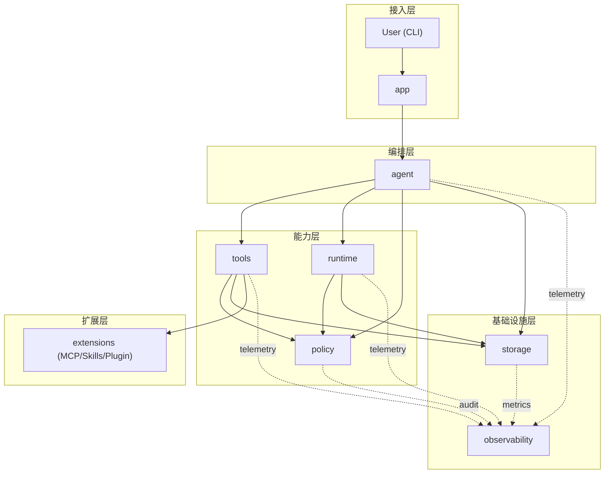

# bytemind 总体架构设计文档（Go 生态）

## 1. 文档目标
本文档定义 bytemind 的完整总体架构，作为技术评审、研发实施、演进治理的统一基线。

## 2. 既定约束
1. 明确单入口 TUI，无 Gateway。
2. 无长期 Memory，无跨会话语义记忆。
3. 会话、任务，不依赖数据库。

## 3. 架构目标
1. 支持 coding agent 主闭环：理解任务、调用工具、修改代码、执行验证、返回结果。
2. 支持长任务与并发：任务系统、后台执行、多代理协作。
3. 支持扩展：MCP、Skills。
4. 支持安全可控：权限分层、沙箱执行、风险拦截。
5. 支持工程治理：可恢复、可追踪、可测试。

## 4. 非目标
1. 不做多入口统一接入层。
2. 不做向量检索与长期知识记忆。
3. 不绑定中心化数据库部署。

## 5. 架构原则
1. Secure by Default：默认最小权限，高风险操作显式确认。
2. 单一职责：原子能力优先，复杂行为通过编排组合。
3. 显式状态：关键状态可持久化、可回放、可恢复。
4. 流式优先：事件级输出，避免黑盒执行。
5. 低耦合扩展：核心引擎稳定，扩展通过标准契约接入。
6. 可验证性：每个核心机制均有可执行测试与验收指标。

## 6. 总体架构



## 7. 模块拆分与目录结构（Go）

```text
bytemind/
  cmd/
    bytemind/
  internal/
    app/             # 启动装配、配置、生命周期
    agent/           # 主循环、上下文构建、模型交互
    tools/           # 工具契约、注册、执行、事件流
    runtime/         # 任务系统、工作流、多代理调度
    policy/          # 权限决策与安全防护
    storage/         # 文件存储、回放恢复
    extensions/      # MCP、Skills
```

## 8. 模块职责（做什么 / 不做什么）

1. `app`
- 做：配置加载、依赖注入、进程生命周期管理。
- 不做：业务编排和策略判断。

2. `agent`
- 做：用户消息处理、上下文拼装、模型流式处理、工具调用编排。
- 不做：工具实现细节、权限规则实现、持久化细节。

3. `tools`
- 做：工具契约、参数校验、执行调度、标准事件流输出。
- 不做：会话级策略决策。

4. `runtime`
- 做：任务状态机、超时/取消/重试、多代理调度、结果归并。
- 不做：权限规则定义。

5. `policy`
- 做：allow/deny/ask 决策、风险分级、路径/命令/敏感文件防护。
- 不做：业务动作执行。

6. `storage`
- 做：会话/任务文件写入、恢复回放、幂等去重。
- 不做：业务决策与调度。

7. `extensions`
- 做：MCP/Skills以统一契约接入 tools 层。
- 不做：主循环控制。

## 9. 强制依赖约束
1. 禁止循环依赖。
2. `app` 只做装配，不承载业务逻辑。
3. `agent` 仅通过接口访问 `tools/runtime/policy/storage`。
4. `extensions` 不可直接读写 `agent` 内部状态。
5. `policy` 必须是独立可测试模块，不依赖 `agent` 具体实现。

## 10. 模块级设计交付标准（每个模块 2 个文件）

每个核心模块目录都必须包含以下两个文件：
1. `README.md`：讲清楚模块定位、边界、内部实现逻辑、依赖关系、测试策略。
2. `interface.go`：仅放模块对外暴露的 Go 风格接口与核心类型，不放具体实现。

建议目录形态：

```text
internal/<module>/
  README.md
  interface.go
  ...实现文件
```

### 10.1 `README.md` 必写内容模板
1. 模块定位：本模块负责什么，不负责什么。
2. 内部实现：关键子组件、关键流程、状态变更点。
3. 对外契约：暴露哪些接口、输入输出与错误约定。
4. 依赖关系：允许依赖和禁止依赖。
5. 可观测性：指标、日志、审计事件。
6. 测试策略：单测、契约测试、故障测试覆盖范围。

### 10.2 `interface.go` 设计约束
1. 接口按“调用方视角”定义，避免暴露实现细节。
2. 所有阻塞操作必须接收 `context.Context`。
3. 返回错误优先使用语义化错误（可判断、可测试）。
4. 事件流能力统一使用 channel 或迭代器风格，不在接口层泄漏底层 transport。
5. 禁止在接口层引入具体 provider/tool 的实现类型。

### 10.3 各模块 `interface.go` 基线示例

`internal/app/interface.go`
```go
package app

import "context"

type Application interface {
    Run(ctx context.Context) error
    Shutdown(ctx context.Context) error
}
```

`internal/agent/interface.go`
```go
package agent

import "context"

type Service interface {
    HandleUserMessage(ctx context.Context, sessionID string, input string) (<-chan Event, error)
}

type Event struct {
    Type    string
    Payload []byte
}
```

`internal/tools/interface.go`
```go
package tools

import "context"

type Registry interface {
    Get(name string) (Tool, bool)
    List() []ToolMeta
}

type Tool interface {
    Name() string
    Description() string
    Execute(ctx context.Context, args []byte, tctx UseContext) (<-chan Event, error)
}

type ToolMeta struct {
    Name string
}

type UseContext struct {
    SessionID string
    TaskID    string
}

type Event struct {
    Type string
    Data []byte
}
```

`internal/runtime/interface.go`
```go
package runtime

import "context"

type TaskScheduler interface {
    Submit(ctx context.Context, req SubmitRequest) (TaskHandle, error)
    Cancel(ctx context.Context, taskID string) error
}

type TaskHandle interface {
    ID() string
    Wait(ctx context.Context) (TaskResult, error)
}

type SubmitRequest struct {
    Name string
}

type TaskResult struct {
    Status string
}
```

`internal/policy/interface.go`
```go
package policy

import "context"

type Engine interface {
    Decide(ctx context.Context, input DecisionInput) (DecisionOutput, error)
}

type DecisionInput struct {
    ToolName string
    Path     string
    Command  string
}

type DecisionOutput struct {
    Decision string
    Reason   string
    Risk     string
}
```

`internal/storage/interface.go`
```go
package storage

import "context"

type SessionStore interface {
    AppendEvent(ctx context.Context, sessionID string, evt Event) error
    Replay(ctx context.Context, sessionID string, fromOffset int64) ([]Event, error)
}

type TaskStore interface {
    AppendLog(ctx context.Context, taskID string, chunk []byte) error
}

type Event struct {
    ID   string
    Type string
    Data []byte
}
```

`internal/extensions/interface.go`
```go
package extensions

import "context"

type Loader interface {
    LoadAll(ctx context.Context) ([]Provider, error)
}

type Provider interface {
    Name() string
    Tools(ctx context.Context) ([]ToolAdapter, error)
}

type ToolAdapter interface {
    ToolName() string
}
```

## 11. 核心领域模型（基线）

```go
type SessionID string
type TaskID string

type TaskStatus string
const (
    TaskPending   TaskStatus = "pending"
    TaskRunning   TaskStatus = "running"
    TaskCompleted TaskStatus = "completed"
    TaskFailed    TaskStatus = "failed"
    TaskKilled    TaskStatus = "killed"
)

type Decision string
const (
    DecisionAllow Decision = "allow"
    DecisionDeny  Decision = "deny"
    DecisionAsk   Decision = "ask"
)

type RiskLevel string
const (
    RiskLow    RiskLevel = "low"
    RiskMedium RiskLevel = "medium"
    RiskHigh   RiskLevel = "high"
)

type PermissionDecision struct {
    Decision   Decision
    ReasonCode string
    RiskLevel  RiskLevel
}
```

## 12. 核心执行流程

### 12.1 单代理主闭环
1. 用户提交消息到 `agent`。
2. `agent` 构建上下文并计算 token 预算。
3. `agent` 调用模型并接收流式事件。
4. 工具调用前经 `policy` 决策。
5. `tools` 执行并流式返回结果。
6. `storage` 追加写入会话与审计。
7. `agent` 返回最终响应。

### 12.2 自动压缩（无 Memory）
1. 触发阈值：`warning >= 85%`，`critical >= 95%`。
2. 约束：`tool_use` 与 `tool_result` 必须成对保留。
3. 回退：`prompt_too_long` 触发一次 reactive compact + 重试。

### 12.3 任务系统
1. 状态机：`pending -> running -> completed|failed|killed`。
2. 必备机制：超时、取消传播、最大重试次数、终态回收。
3. 输出：任务日志按 offset 增量读取。

### 12.4 子代理
1. 同步子代理：父代理等待子代理返回。
2. 异步后台代理：父代理继续执行，后续归并结果。
3. worktree 隔离代理：独立分支与工作区，避免主工作区污染。

## 13. Tools 体系设计

### 13.1 三层结构
1. 原子工具层：`ReadFile` `EditFile` `WriteFile` `Glob` `Grep` `Bash`。
2. 组合工具层：`TestRunner` `GitWorkflow` `TaskOutputReader`。
3. 协作工具层：`AgentTool` `MCPTool` `SkillTool` `TeamTool`。

### 13.2 统一契约
```go
type Tool interface {
    Name() string
    Description() string
    Schema() json.RawMessage
    Execute(ctx context.Context, args json.RawMessage, tctx ToolUseContext) (<-chan ToolEvent, error)
}
```

### 13.3 强制规范
1. 参数 schema 强校验。
2. 显式声明副作用级别与幂等级别。
3. 支持超时、取消、重试语义。
4. 统一事件流：`start/chunk/result/error`。
5. 每个工具必须有 mock/contract 单测。

## 14. 权限与安全架构

### 14.1 五层权限模型
1. 会话模式层：`default` `acceptEdits` `bypassPermissions(受控)` `plan`。
2. 工具白黑名单层：`allowedTools` `deniedTools`。
3. 工具级策略层：读默认放行，写和命令默认询问。
4. 操作风险层：低/中/高风险分级。
5. 路径命令层：`allowedWritePaths` `deniedWritePaths` `allowedCommands` `deniedCommands`。

### 14.2 决策优先级（固定）
`explicit deny > explicit allow > risk rule > mode default > fallback ask`

### 14.3 安全基线
1. Prompt Injection 防护：系统指令优先，工具输出隔离。
2. 路径安全：`resolve + realpath + allowlist`。
3. 命令安全：白名单 + 高危规则。
4. 敏感文件保护：密钥/凭证默认拒绝读取。
5. 沙箱策略：网络开关、路径白名单、资源限额。

## 15. 文件存储与恢复（不落库）

### 15.1 文件布局
1. `~/.bytemind/sessions/<session-id>.jsonl`
2. `~/.bytemind/tasks/<task-id>.log`
3. `~/.bytemind/audit/<date>.jsonl`

### 15.2 一致性策略
1. append-only 写入。
2. 单记录原子落盘（临时文件+rename 或 fsync 策略）。
3. 会话级文件锁，避免并发乱序写。
4. 事件携带 `event_id`，恢复时幂等去重。

## 16. 可观测性

### 16.1 指标
1. 请求成功率、工具成功率、任务成功率。
2. 首字节时延（分层：模型、工具、存储）。
3. token 消耗与单位任务成本。
4. 权限拒绝率与高危拦截率。
5. 压缩触发率与恢复成功率。

### 16.2 Trace
链路贯穿：`agent -> policy -> tools -> runtime -> storage`。

## 17. 测试与治理要求（强制）
1. Contract Test：工具 schema、事件流一致性。
2. Replay Test：session/task 回放一致性。
3. Policy Test：规则冲突、优先级、边界样例。
4. Failure Test：超时、取消、崩溃恢复、重试风暴。
5. Multi-Agent Test：并发配额、资源争用、冲突归并。
6. 安全回归：高危命令、敏感文件、路径逃逸。

## 18. 主要风险与应对
1. 工具误操作风险。
应对：多层权限 + 高危确认 + 沙箱 。
2. 上下文膨胀风险。
应对：预算器 + 自动压缩。
3. 多代理复杂度风险。
应对：依赖图调度 + 配额控制 + 终态约束。
4. 文件一致性风险。
应对：原子写 + 锁 + 幂等回放。

## 19. 结论
该版本在保持完整能力的前提下，将系统稳定收敛到 8 个核心模块（含 `tools`），并补齐了可落地的硬约束：依赖规则、并发控制、权限优先级、文件一致性、可观测与测试治理。
