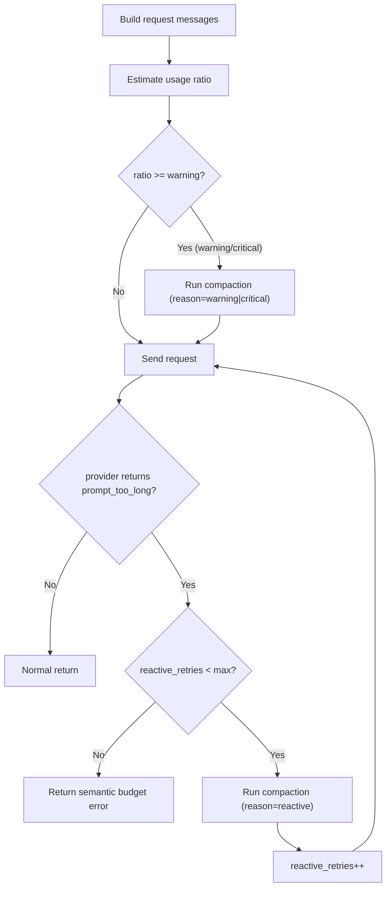

# Issue Design: Context 双阈值预算 + `prompt_too_long` 单次 Reactive 重试

## 1. Issue 信息
- 标题：实现 context 双阈值预算策略（85%/95%）与 `prompt_too_long` 单次 reactive compact + retry
- 类型：Feature + Reliability
- 优先级：P1
- 影响范围：`internal/agent`、`internal/config`、`internal/llm`（可选增强）

## 2. 背景与问题
架构文档要求：
- warning 阈值：`>= 85%`
- critical 阈值：`>= 95%`
- `prompt_too_long`：仅允许一次 reactive compact + 重试

当前实现现状：
- 仅有单阈值 `95%` 自动压缩触发，缺少 warning 层（`internal/agent/compaction.go`）。
- 当 prompt 过长时直接返回错误，没有执行“reactive compact + 重试一次”（`internal/agent/compaction.go`、`internal/agent/runner.go`）。

直接影响：
- 预算策略过于粗粒度，无法在 warning 区间提前温和压缩。
- token 估算偏差或 provider 实际窗口限制触发 `prompt_too_long` 时，缺少兜底恢复路径。
- 与架构文档约束不一致，测试与行为预期难以对齐。

## 3. 目标（Goals）
- 实现双阈值预算策略：
1. `usage >= 85%` 触发 warning compaction
2. `usage >= 95%` 触发 critical compaction
- 实现 `prompt_too_long` 的单次 reactive compaction + retry：
1. 每次用户请求最多一次 reactive 重试
2. 重试后仍失败则返回语义化错误
- 保持现有调用链兼容，不引入破坏性 API 变更。

## 4. 非目标（Non-Goals）
- 本 Issue 不引入完整 `internal/context` 模块重构（Builder/Budgeter/Compactor/InvariantChecker 分治）。
- 本 Issue 不覆盖 `tool_use/tool_result` 强制成对保留规则（另开 Issue）。
- 本 Issue 不做 provider 全量错误语义重构，仅补足 `prompt_too_long` 判定所需最小能力。

## 5. 需求细化

### 5.1 双阈值预算策略
- 输入：
1. `token_quota`
2. `warning_ratio`（默认 `0.85`）
3. `critical_ratio`（默认 `0.95`）
- 预算计算：
1. `usage_ratio = estimated_request_tokens / token_quota`
2. 级别判定：
   - `< warning`：不压缩
   - `>= warning && < critical`：warning compaction
   - `>= critical`：critical compaction

### 5.2 `prompt_too_long` 单次 reactive 重试
- 触发条件（满足任一）：
1. 预算或组包阶段判定本次请求不可发送（超窗口）
2. provider 返回“上下文过长/窗口超限”语义错误（含 streaming 与非 streaming）
- 动作：
1. 对 session 执行一次 `reason=reactive` compaction
2. 重新构建请求并重试一次
- 上限：
1. 每次 `RunPromptWithInput` 最多 reactive 重试 `1` 次（可配置，默认 1）
- 失败：
1. 若 reactive 后仍 `prompt_too_long`，返回语义化错误（如 `budget_exceeded`）

## 6. 方案设计

### 6.1 配置设计（向后兼容）
在 `internal/config.Config` 增加 context 预算配置（建议子结构）：

```go
type ContextBudgetConfig struct {
    WarningRatio     float64 `json:"warning_ratio"`      // default 0.85
    CriticalRatio    float64 `json:"critical_ratio"`     // default 0.95
    MaxReactiveRetry int     `json:"max_reactive_retry"` // default 1
}
```

主配置增加字段：

```go
ContextBudget ContextBudgetConfig `json:"context_budget"`
```

兼容性要求：
- 老配置文件无该字段时使用默认值。
- 校验约束：
1. `0 < warning_ratio < critical_ratio <= 1`
2. `max_reactive_retry >= 0`

### 6.2 预算判定逻辑
在 `internal/agent/compaction.go` 抽象预算级别判定：

```go
type budgetLevel string

const (
    budgetNone     budgetLevel = "none"
    budgetWarning  budgetLevel = "warning"
    budgetCritical budgetLevel = "critical"
)

func classifyBudget(usageRatio, warning, critical float64) budgetLevel
```

压缩触发策略：
- `warning`: 执行温和压缩（保留最新用户消息 + 摘要）
- `critical`: 执行激进压缩（行为先与 warning 一致，后续可扩展策略差异）

说明：
- 第一版允许 warning/critical 共用当前 `compactSession(... keepLatestUser=true)`，先达成阈值与流程正确性。
- compaction `meta.reason` 写入 `warning|critical|reactive` 便于观测。

### 6.3 Reactive 重试控制
在 `RunPromptWithInput` 中引入单次重试状态：

```go
reactiveRetries := 0
maxReactiveRetries := r.config.ContextBudget.MaxReactiveRetry
```

处理流程：
1. 发送前预算判断：若判定不可发送，先尝试 normal compaction（warning/critical）。
2. 调用 provider：
   - 若报错且 `isPromptTooLongError(err) == true`
   - 且 `reactiveRetries < maxReactiveRetries`
   - 执行 `compactSession(reason="reactive")`，`reactiveRetries++`，`continue` 当前 step 重试。
3. 否则返回原错误。

### 6.4 `prompt_too_long` 错误判定
新增统一判定函数（`internal/agent`）：

```go
func isPromptTooLongError(err error) bool
```

建议判定来源（最小可行）：
1. 本地预算错误文本（现有 `"prompt too long"`）
2. `*llm.ProviderError` 的 message 模式匹配（如 `context length`, `maximum context`, `too many tokens`, `prompt is too long`）

可选增强（推荐）：
- 在 `internal/llm/errors.go` 增加 `ErrorCodeContextTooLong`，由 `MapProviderError` 赋码，业务层优先按 code 判断，文本匹配作为兜底。

## 7. 关键流程（Mermaid）



## 8. 代码改动建议（分步）

### Step 1: 配置与校验
- `internal/config/config.go`
1. 新增 `ContextBudgetConfig`
2. 默认值、normalize 校验、环境变量映射（可选）
- `docs/environment-variables.md`
1. 新增相关配置说明（若支持 env 覆盖）

### Step 2: agent 预算双阈值
- `internal/agent/compaction.go`
1. 替换固定 `95%` 单阈值逻辑
2. 引入 `classifyBudget`
3. 支持 `warning|critical` reason 写入 compaction meta

### Step 3: reactive 单次重试
- `internal/agent/runner.go`
1. 在 `completeTurn` 报错路径添加 `prompt_too_long` 判定
2. 按 `MaxReactiveRetry` 执行一次 reactive compaction + retry
3. 保证不会无限循环

### Step 4（可选增强）: 语义错误码
- `internal/llm/errors.go`
1. 新增 `ErrorCodeContextTooLong`
2. `MapProviderError` 按 message/status 映射

## 9. 测试设计

### 9.1 单元测试：预算分类
- 文件：`internal/agent/compaction_test.go`（或现有测试文件）
- 用例：
1. `84.99%` -> none
2. `85.00%` -> warning
3. `94.99%` -> warning
4. `95.00%` -> critical

### 9.2 行为测试：warning/critical 触发
- 文件：`internal/agent/runner_test.go`
- 用例：
1. 请求处于 warning，触发一次 compaction 后继续成功
2. 请求处于 critical，触发一次 compaction 后继续成功
3. compaction `meta.reason` 正确写入

### 9.3 行为测试：reactive 单次重试
- 文件：`internal/agent/runner_test.go`
- 用例：
1. 第一次 provider 返回 prompt_too_long，第二次成功 -> 总请求次数=2，且有 reactive compaction
2. 两次都 prompt_too_long -> 仅重试一次后失败
3. 非 prompt_too_long 错误 -> 不触发 reactive 重试

### 9.4 回归测试
- 现有 compaction 相关测试全部通过：
1. 自动压缩路径
2. 手动压缩路径
3. fallback summary 路径

## 10. 验收标准（DoD）
- 双阈值生效：`85%` warning、`95%` critical。
- `prompt_too_long` 场景最多 reactive 重试一次。
- 无无限重试或死循环。
- 配置默认值兼容老版本配置文件。
- 新增/变更测试通过，且覆盖关键边界。
- 文档与实现一致（包括配置说明与行为说明）。

## 11. 风险与缓解
- 风险：文本匹配误判 `prompt_too_long`。
  - 缓解：优先使用语义错误码，文本匹配仅兜底。
- 风险：compaction 后仍超长，导致重复失败。
  - 缓解：严格限制重试次数为 1，返回清晰错误信息。
- 风险：warning 过于激进影响上下文质量。
  - 缓解：第一版先保持现有压缩策略，后续再迭代 warning/critical 的差异化压缩强度。

## 12. 任务拆分（可直接放到 Issue Checklist）
- [ ] 配置层新增 `context_budget`（默认值 + 校验 + 兼容）
- [ ] 实现预算双阈值分类逻辑
- [ ] 接入 warning/critical 压缩触发
- [ ] 实现 `isPromptTooLongError` 判定
- [ ] 接入 `prompt_too_long` 单次 reactive 重试
- [ ] （可选）`llm` 增加 `context_too_long` 语义错误码
- [ ] 新增/更新测试（预算边界、reactive 重试、回归）
- [ ] 更新文档（配置项与行为）

## 13. 预计改动文件清单
- `internal/config/config.go`
- `internal/agent/compaction.go`
- `internal/agent/runner.go`
- `internal/agent/runner_test.go`
- `internal/agent/compaction_test.go`（如新增）
- `internal/llm/errors.go`（可选增强）
- `docs/environment-variables.md`

