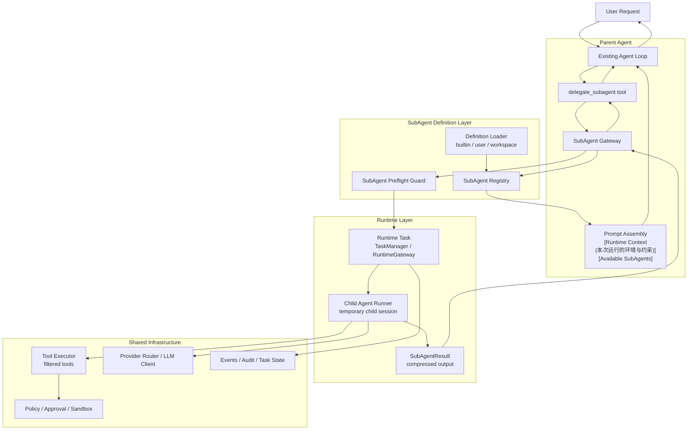

# ByteMind SubAgent 架构设计

## 背景

ByteMind 需要支持 SubAgent，用来把复杂任务拆给更专注的执行上下文。它的首要价值不是制造一个更复杂的多 Agent 系统，而是在长任务中保护主 Agent 的上下文：搜索、阅读、审查、定位、试错等高噪声过程可以在独立上下文里完成，主 Agent 只接收压缩后的结论、发现和引用。

本设计面向三类目标：

- 上下文隔离：SubAgent 不继承主会话完整历史，不把完整探索过程写回主会话。
- 专注执行：每个 SubAgent 类型都有明确职责、工具边界、返回格式和运行约束。
- 复用现有能力：尽量复用现有 agent loop、prompt assembly、tool executor、runtime task manager、policy gateway、sandbox、session/event/audit 机制。

## 非目标

- 不支持 SubAgent 无限递归派生 SubAgent。
- 不把 SubAgent 做成长驻进程、远程服务或跨会话自治 worker。
- 不让 SubAgent 获得比主 Agent 更高的工具、文件或审批权限。
- 不在 MVP 中引入复杂团队编排、跨 SubAgent 多轮协商或共享记忆。

## 参考协议

ByteMind 的用户自定义 SubAgent 定义格式参考 Claude Code 的 subagent 文件协议：使用单个 `.md` 文件，文件头用 YAML frontmatter 描述元数据和工具配置，后面的 Markdown 正文作为该 SubAgent 的定义正文。Claude Code 官方文档中，`name` 和 `description` 是必填字段，`tools` 是可选字段；项目级定义优先于用户级定义。

ByteMind 沿用这套文件格式，但具体运行语义按现有架构收敛：

- 采用：单个 `.md` 文件，文件头用 YAML frontmatter 写配置，正文用 Markdown 写提示词；基础字段沿用与 Claude Code 对齐的 `name`、`description`、`tools`。
- 扩展：ByteMind 额外支持 `disallowed_tools`、`model`、`max_turns`、`timeout`、`isolation` 等字段。
- 调整：SubAgent 正文只作为 `[SubAgent Definition]` 附加到现有 prompt assembly 中，不覆盖 ByteMind 原有的系统提示和安全规则。
- 调整：工具权限只能收窄，不能扩大；最终工具集必须是父会话可用工具集与 SubAgent 定义工具集的交集，并强制移除 `delegate_subagent`。
- 调整：`isolation` 既可以出现在 SubAgent 定义中作为默认运行策略，也可以在启动 SubAgent 的工具调用中作为一次性覆盖；工具调用参数优先。若最终工具集中包含写操作，`isolation` 默认提升为 `worktree`。

参考链接：

- [Claude Code custom subagents](https://docs.anthropic.com/en/docs/claude-code/sub-agents)
- [Claude Code settings](https://docs.anthropic.com/en/docs/claude-code/settings)
- [Claude Code common workflows (worktree)](https://code.claude.com/docs/en/common-workflows)

## 总体架构



## 与现状对齐

为避免设计与当前代码实现脱节，MVP 以仓库现状为硬约束：

- `internal/agent.RuntimeGateway` 当前仅提供 `RunSync`；若采用“同步/异步统一 task 语义”，MVP 需要让同步委派也落到 runtime task（可扩展 `RuntimeGateway`，或由 `SubAgentGateway` 直接复用 `runtime.SubAgentCoordinator` + `TaskManager` 并等待终态）。
- `internal/runtime` 已有 `SubAgentCoordinator` 与 quota 释放语义；同步与后台委派都优先复用该实现，不新增平行协调器。
- 当前默认工具注册中尚无 `task_output`、`task_stop`；后台可读/可停依赖这两个工具。前台停止优先复用“中止当前回复”并映射到 runtime cancel，不新增用户命令。
- 当前 slash commands 尚无 `/agents`、`/review`、`/explorer`；阶段 1 需要补充这些命令及测试。
- Prompt 组装顺序已由 `internal/agent/prompt.go` 固化，SubAgent 扩展只能附加 runtime context，不能改组装顺序。

若本文其他段落与上述约束冲突，以上述约束为准。

关键边界：

- 父会话只看到 `delegate_subagent` 的工具调用和 `SubAgentResult` 工具结果。
- 子会话有独立消息列表和独立 system prompt，不继承父会话完整消息历史。
- 子会话默认共享同一工作区视图；若启用 `isolation: worktree` 或命中“写工具强制隔离”规则，则切换到临时 worktree 视图。无论哪种视图，工具集都会被收窄，审批和沙箱仍走现有链路。
- SubAgent 定义层是提示词渲染、运行时校验、工具过滤和子 prompt 组装的唯一事实来源。

## 定义发现与优先级

SubAgent 定义来源分为三层：

| 来源 | 路径 | 作用域 | 优先级 |
| --- | --- | --- | --- |
| 工作区自定义 | `<workspace>/.bytemind/subagents/*.md` | 当前仓库 | 最高 |
| 用户自定义 | `${BYTEMIND_HOME:-~/.bytemind}/subagents/*.md` | 当前用户所有仓库 | 中 |
| 内置定义 | `internal/subagents/builtin/*.md` | ByteMind 默认能力 | 最低 |

冲突规则：

- 按 `name` 归并，同名时高优先级覆盖低优先级。
- 覆盖链用于通用名称解析（如 `delegate_subagent.agent`）；保留 slash 命令 `/review`、`/explorer` 始终绑定内置定义 ID（建议 `builtin.review`、`builtin.explorer`），不走同名覆盖。
- 覆盖只发生在整份定义粒度，不做字段级 merge，避免最终行为不可解释。
- 加载器保留 diagnostics：非法 frontmatter、未知工具、重复名称、被覆盖来源、禁用字段等。
- MVP 在 Runner 初始化或 session start 时加载；后续可以支持 `/subagents reload` 或 TUI 管理入口。

## `/agents` 交互契约

为满足“用户可查看自定义 SubAgent，同时以内置 slash 命令直接触发内置能力”，定义以下命令契约：

### 用户显式调用姿势（MVP）

- `/review <task>`：显式调用内置 `review` 子代理（固定绑定 `builtin.review`，不受同名覆盖影响），默认前台执行（可中止）。
- `/explorer <task>`：显式调用内置 `explorer` 子代理（固定绑定 `builtin.explorer`，不受同名覆盖影响），默认前台执行（可中止）。
- 若用户提供同名 `review`/`explorer` 定义，该定义仍按覆盖链参与通用解析（例如主 Agent 内部 `delegate_subagent` 调度），但不改变上述保留 slash 行为。
- `/agents`：只用于查看“用户自定义且当前生效”的 SubAgent 及其定义详情。
- 本期不新增“自定义 SubAgent 显式执行”的通用 slash 命令；自定义 SubAgent 仍由主 Agent 在内部通过 `delegate_subagent` 调度。

### 命令

- `/agents`：展示用户自定义且当前生效的 SubAgent 列表（`source` 仅 `workspace` / `user`），并支持查看选中 SubAgent 的定义详情。

为收敛 MVP 交互复杂度，`/agents` 仅承担“查看用户自定义 SubAgent 及其定义”能力，不承担全量来源对比与诊断浏览。

### `/agents` 列表字段（最小集）

| 字段 | 说明 |
| --- | --- |
| `name` | 生效名称（唯一键） |
| `description` | 给主 Agent 的委派说明 |
| `tools` | 最终允许工具摘要（过滤前） |
| `source` | 当前生效定义来源：`workspace` / `user` |

### 定义详情字段

- frontmatter 规范化后的主要字段：`name`、`description`、`schema_version`、`tools`、`disallowed_tools`、`model`、`max_turns`、`timeout`、`mode`、`isolation`、`aliases`。
- `definition_body`：Markdown 正文原文。

### 排序规则

- `/agents` 列表按 `name` 升序展示，每个 `name` 仅显示当前生效的一条定义。

### 说明

- `/agents` 不展示内置 `review`、`explorer`；这两个能力通过 `/review`、`/explorer` 直接调用。
- 覆盖链和 loader diagnostics 先保留在内部日志或调试视图，不作为 `/agents` 的 MVP 输出契约。

## Markdown 定义协议

文件结构：

```markdown
---
name: code-reviewer
description: Reviews recent code changes for correctness, regressions, security, and missing tests.
tools:
  - read_file
  - search_text
  - list_files
max_turns: 8
timeout: 2m
---

You are a focused code review SubAgent.

Review only the task scope provided by the parent agent. Return findings first,
ordered by severity, with file and line references when possible. Do not edit files.
```

### Frontmatter 字段

命名约定：

- SubAgent 定义文件中的外部字段统一使用 `snake_case`。
- Go 结构体和内部代码字段保持 Go 约定的 `CamelCase`。

MVP 字段分层（避免首版过度设计）：

- MVP 核心字段：`name`、`description`、`tools`、`disallowed_tools`、`max_turns`、`timeout`、`isolation`。
- MVP 可先弱化字段：`schema_version`、`model`、`mode`、`aliases`（允许解析但可忽略，并产生 diagnostics）。

| 字段 | 必填 | 说明 |
| --- | --- | --- |
| `name` | 是 | 唯一 ID。建议小写 kebab-case，例如 `code-reviewer`；内部也接受 `_`、`.`、`:` 以兼容 ByteMind 现有 skill 命名风格。 |
| `description` | 是 | 给主 Agent 看的触发说明。它决定何时适合委派。应写清适用场景和不适用场景。 |
| `schema_version` | 否 | 协议版本，默认 `1`。MVP 非必填；当前仅支持 `1`，高于已支持版本时产出 diagnostics（`unsupported_schema_version`）并使该定义不生效。 |
| `tools` | 否 | 允许工具列表，推荐使用 YAML 数组。省略时继承父会话当前可见工具，但仍强制移除 `delegate_subagent`，且不能改变运行时权限策略。 |
| `disallowed_tools` | 否 | 从继承或显式允许列表中移除的工具，推荐使用 YAML 数组。 |
| `model` | 否 | 具体模型 ID。省略时继承父会话当前模型；也接受 `inherit` 作为显式继承写法。MVP 可先只支持空值/`inherit`，非空模型 ID 先报 diagnostics 并忽略。 |
| `max_turns` | 否 | 子 agent loop 最大轮数，默认取全局上限中较小值。 |
| `timeout` | 否 | 单次委派超时，例如 `90s`、`2m`。 |
| `mode` | 否 | `build` 或 `plan`。默认继承父会话模式；定义只能收窄能力，不扩大工具可用模式。MVP 可先忽略该字段并继承父模式。 |
| `isolation` | 否 | 可选运行隔离策略。`worktree` 表示在临时 Git worktree 中运行；省略时仅在“只读工具集”下使用临时子会话，否则按写工具规则提升为 `worktree`。工具调用中的 `isolation` 会覆盖这里的默认值。 |
| `aliases` | 否 | 别名列表，推荐使用 YAML 数组。MVP 可先只保留 `name` 匹配，别名匹配后补。 |

暂不支持或 MVP 忽略：

- `permission_mode`：MVP 不支持。SubAgent 始终继承父会话当前的 approval policy，不能通过定义文件放宽审批权限。
- `hooks`、`memory`、`mcp_servers`：可作为后续扩展，MVP 先不执行。
- `background`（frontmatter 字段）：MVP 不支持在定义文件里声明后台策略；后台与否由 `delegate_subagent.run_in_background` 决定。

### 正文语义

Markdown 正文用于定义子代理的角色、执行方式和输出约束。它不应包含 ByteMind 全局安全规则，也不应该复制 AGENTS.md。运行时会把正文注入到子会话 prompt 的 `[SubAgent Definition]` 块中；这段正文只是附加定义，不会覆盖 ByteMind 原有的系统提示和安全规则。

正文建议包含：

- 角色边界：这个 SubAgent 负责什么、不负责什么。
- 执行方式：搜索、阅读、验证、审查或总结的偏好。
- 输出要求：要返回哪些字段，如何组织结论。
- 禁止行为：是否允许修改文件、运行 shell、联网等。

## 内置 SubAgent

用户侧显式入口固定为 slash 命令：

- `explorer` 对应 `/explorer <task>`。
- `review` 对应 `/review <task>`。

### `explorer`

`explorer` 是只读代码探索型 SubAgent，用于定位代码、调用链、配置来源、prompt 拼装路径和错误来源。

建议定义：

```markdown
---
name: explorer
description: Read-only repository exploration agent. Use for locating files, symbols, call chains, configuration flow, prompt assembly, and error origins. Do not use for editing.
tools:
  - list_files
  - read_file
  - search_text
max_turns: 6
timeout: 90s
---

You are a focused repository explorer. Search and read only what is needed.
Return a concise summary, key findings, and file references. Do not edit files,
run shell commands, or make implementation changes.
```

输出重点：

- `summary`：一句话结论。
- `findings`：少量关键发现。
- `references`：文件、行号和说明。

### `review`

`review` 是代码审查型 SubAgent，用于审查已修改代码、发现潜在 bug、回归风险、安全问题和缺失测试。它默认不修改文件。

建议定义：

```markdown
---
name: review
description: Code review agent. Use after code changes to find correctness, regression, security, maintainability, and test coverage issues. Findings first; no edits.
tools:
  - list_files
  - read_file
  - search_text
max_turns: 8
timeout: 2m
---

You are a code reviewer. Prioritize concrete bugs and behavioral regressions.
Return findings first, ordered by severity, with tight file references. Mention
test gaps and residual risks. Do not rewrite code.
```

后续可给 `review` 增加受控 `run_shell` 权限，用于运行窄测试；MVP 建议先保持只读，避免 review 子任务在后台触发审批和副作用。

## Prompt 接入

仓库要求系统提示词组装顺序保持不变：

1. `internal/agent/prompts/default.md`
2. `internal/agent/prompts/mode/{build|plan}.md`
3. runtime context block（当前这次 agent 运行时生效的环境与约束）
4. optional active skill block
5. `AGENTS.md` instruction block

SubAgent 只扩展 runtime context block，不改变现有组装顺序。

### 父会话 Prompt

在 `[Runtime Context]`（当前这次 agent 运行时生效的环境与约束）中增加 `[Available SubAgents]`：

```text
[Available SubAgents]
- explorer: Read-only repository exploration agent. Use for locating files, symbols, call chains, configuration flow, prompt assembly, and error origins.
- review: Code review agent. Use after code changes to find correctness, regression, security, maintainability, and test coverage issues.
```

父会话还需要知道：

- 可以通过 `delegate_subagent` 委派清晰、独立、可压缩的子任务。
- 委派任务必须具体，不能让 SubAgent 猜测主 Agent 的隐藏意图。
- 主 Agent 负责最终判断，不能盲目采纳 SubAgent 输出。
- SubAgent 不适合需要和用户来回确认、需要主 Agent 全程参与、或必须保留完整过程的任务。

### 子会话 Prompt

子会话复用现有 prompt assembly，但 runtime context 改为子会话视角，并在 runtime context block 中增加两个子块：

```text
[SubAgent Runtime]
name: explorer
parent_session_id: ...
invocation_id: ...
task: Locate where the system prompt is assembled and summarize the order.
scope_paths: internal/agent
allowed_tools: list_files, read_file, search_text
result_policy: Return only compressed findings. Do not include full search logs.

[SubAgent Definition]
...markdown body...
```

子会话的工具列表必须是过滤后的工具集，不暴露 `delegate_subagent`。子会话默认不继承父会话 active skill；如果后续支持 frontmatter `skills`，也应显式加载而不是隐式继承。

## 委派工具设计

MVP 暴露一个主 Agent 可调用工具：

```text
delegate_subagent
```

参数：

```json
{
  "agent": "explorer",
  "task": "Locate where the system prompt is assembled and summarize the order.",
  "scope": {
    "paths": ["internal/agent"],
    "symbols": ["systemPrompt", "buildTurnMessages"]
  },
  "timeout": "90s",
  "isolation": "worktree",
  "run_in_background": true
}
```

字段：

- `agent`：必填，SubAgent 名称或别名。
- `task`：必填，明确、独立、可验证的子任务描述。
- `scope.paths`：可选，路径范围提示。只能收窄任务，不扩大权限。
- `scope.symbols`：可选，符号范围提示。
- `timeout`：可选，最终受定义值、内部默认上限和父运行上下文约束。
- `isolation`：可选，覆盖 SubAgent 定义中的默认隔离策略。MVP 建议只支持 `worktree`；省略时先用定义默认值，若定义也省略则按写工具规则决定（写工具 => `worktree`，只读 => 临时子会话）。
- `run_in_background`：可选，`true` 时异步启动并立即返回任务句柄；默认 `false`（同步等待同一个 runtime task 的终态结果）。

返回：

```json
{
  "ok": true,
  "invocation_id": "subagent-...",
  "agent": "explorer",
  "summary": "systemPrompt assembles default prompt, mode prompt, runtime context, active skill, then AGENTS instructions.",
  "findings": [
    {
      "title": "Prompt assembly order",
      "body": "The order is implemented by systemPrompt and used by buildTurnMessages."
    }
  ],
  "references": [
    {
      "path": "internal/agent/prompt.go",
      "line": 39,
      "note": "systemPrompt assembly"
    }
  ]
}
```

返回契约（MVP）：

- `findings` 始终返回数组，允许为空 `[]`。
- `references` 始终返回数组，允许为空 `[]`。
- 不返回 `null`，也不省略这两个字段。

字段语义：

- `summary`：一句话结论，供主 Agent 快速判断子任务结果。
- `findings`：关键发现列表（结构化要点），每项包含 `title` 和 `body`。主 Agent 应优先消费该字段来做结果整合，而不是依赖子会话长文本。
- `references`：证据定位列表（文件/行号/备注），用于支撑 `findings` 并便于追溯。

失败返回仍是结构化错误结果：

```json
{
  "ok": false,
  "invocation_id": "subagent-...",
  "agent": "review",
  "findings": [],
  "references": [],
  "error": {
    "code": "subagent_tool_denied",
    "message": "review is not allowed to use apply_patch",
    "retryable": false
  }
}
```

后台启动返回（`run_in_background=true`）：

```json
{
  "ok": true,
  "status": "async_launched",
  "invocation_id": "subagent-...",
  "agent": "explorer",
  "task_id": "20260427153000.123456789-000001",
  "result_read_tool": "task_output",
  "stop_tool": "task_stop"
}
```

后台任务结果读取与停止优先复用通用 task lifecycle 工具（`task_output`、`task_stop`），而不是新增 `wait_subagent`、`cancel_subagent`。
`task_id` 是调用方消费契约（主 Agent/CLI/TUI/SDK），不要求暴露为终端用户主动查询入口。

同步/异步统一任务语义（MVP 决策）：

- 无论 `run_in_background` 为 `true` 还是 `false`，`SubAgentGateway` 都先创建 runtime task 并获得 `task_id`。
- `run_in_background=false`：Gateway 同步等待该 task 终态，再返回 `SubAgentResult`。
- `run_in_background=true`：Gateway 立即返回 `async_launched + task_id`，由调用方（主 Agent/CLI/TUI/SDK）后续读取/停止并按产品策略向用户汇总。
- 用户显式触发的前台子任务允许停止：用户“中止当前回复”时，系统将取消父上下文并转发为对应 task cancel（语义等价 `task_stop`）。

后台协议落地要求（MVP 硬约束）：

- `run_in_background=true` 仅在 `task_output`、`task_stop` 已注册时可用；否则启动前失败并返回 `subagent_background_unavailable`。
- `task_output` 至少支持参数：`task_id`、`offset`、`limit`。
- `task_stop` 至少支持参数：`task_id`、`reason`（可选）。
- 后台结果统一通过 `task_id + task_output` 读取。

### 后台能力决策

- 本期必达：支持 `run_in_background` 的后台 SubAgent。
- 本期不做：同一轮 assistant message 内多个工具调用并行执行。
- 同轮并行不在本架构设计范围内；当出现明确瓶颈（例如同类只读子任务串行导致端到端时延不可接受）时，再单独产出并发设计文档与语义契约。

## 运行时组件

本节中的对象按职责可分为两类：

- `SubAgentDefinition`、`SubAgentInvocation`、`SubAgentResult`：数据模型，定义“配置/请求/返回”三层契约。
- `SubAgentRegistry`、`SubAgentGateway`、`WorktreeManager`、`SubAgentDispatcher`：运行时组件，负责加载、编排、隔离与调度。

### SubAgentDefinition

```go
type SubAgentDefinition struct {
    Name              string
    Description       string
    Aliases           []string
    Source            SubAgentSource
    Tools             []string
    DisallowedTools   []string
    Model             string
    Mode              string
    MaxTurns          int
    Timeout           time.Duration
    Isolation         string
    SystemPromptBody  string
}
```

`Description` 用于在父 prompt 中展示，并作为模型判断是否委派的说明；`SystemPromptBody` 只注入子 prompt。

用途：

- 表示“某个 SubAgent 的静态定义快照”，是工具过滤、prompt 注入和运行约束的统一输入。

谁写入：

- `SubAgentRegistry` 在加载 builtin/user/workspace 定义后写入（启动时或 reload 时）。

谁读取：

- `SubAgentGateway`（解析委派目标、校验参数）。
- prompt 组装路径（渲染 `[Available SubAgents]`、`[SubAgent Definition]`）。
- 工具权限收窄逻辑（`Tools`/`DisallowedTools`）。

字段重点：

- `Name`：唯一键与委派目标标识。
- `Source`：来源层级（workspace/user/builtin），用于覆盖判定与诊断。
- `MaxTurns`、`Timeout`、`Isolation`：运行约束，最终还会受全局上限与安全规则二次收敛。

### SubAgentInvocation

```go
type SubAgentInvocation struct {
    InvocationID    string
    Agent           string
    Task            string
    Scope           SubAgentScope
    ParentSessionID core.SessionID
    ParentTurnID    string
    Timeout         time.Duration
    Isolation       string
}

type SubAgentScope struct {
    Paths   []string
    Symbols []string
}
```

用途：

- 表示“某次委派请求”的运行时上下文，不是静态定义。

谁写入：

- `delegate_subagent` 调用路径由 `SubAgentGateway` 组装。

谁读取：

- SubAgent Preflight Guard（仅做委派入口预检，不替代工具执行期权限校验）。
- 子会话 prompt 渲染（`[SubAgent Runtime]`）。
- task/audit 元数据写入。

字段重点：

- `InvocationID`：本次委派的全局关联键（日志、审计、任务状态统一靠它串联）。
- `Task`：子任务目标文本，要求清晰、可验证。
- `Scope`：只用于“收窄提示与校验输入”，不扩大权限边界。

### SubAgentResult

```go
type SubAgentResult struct {
    InvocationID string
    Agent        string
    OK           bool
    Summary      string
    Findings     []SubAgentFinding
    References   []SubAgentReference
    Error        *SubAgentError
}

type SubAgentFinding struct {
    Title string
    Body  string
}

type SubAgentReference struct {
    Path string
    Line int
    Note string
}

type SubAgentError struct {
    Code      string
    Message   string
    Retryable bool
}
```

用途：

- 主 Agent 与子任务之间的稳定返回契约，避免依赖自由文本解析。

谁写入：

- `SubAgentGateway` 在子会话结束后统一归一化写出。

谁读取：

- 主 Agent（整合结果、决定是否重试/降级）。
- tool result 消费方（CLI/TUI/日志）。

字段重点：

- `OK`：成功/失败分支开关。
- `Summary`：一句话结论。
- `Findings`：结构化关键发现列表（始终返回数组，可空）。
- `References`：证据定位列表（始终返回数组，可空）。
- `Error`：失败时的结构化错误（含可重试语义）。

### SubAgentRegistry

职责：

- 加载 builtin/user/workspace 定义。
- 处理覆盖、别名、诊断信息。
- 为父 prompt 提供简短可用列表。
- 为 Gateway 提供完整定义。
- 校验名称、工具字段、模型字段和超时字段。

接口语义（建议）：

```go
type SubAgentRegistry interface {
    // ListEffective 返回当前生效定义（已完成覆盖与排序）。
    ListEffective() []SubAgentDefinition
    // Resolve 通过 name/alias 查找单个生效定义。
    Resolve(nameOrAlias string) (SubAgentDefinition, bool)
    // Diagnostics 返回加载期诊断信息（非法字段、冲突覆盖等）。
    Diagnostics() []SubAgentDiagnostic
}
```

建议新增包：

```text
internal/subagents/
  definition.go
  diagnostics.go
  loader.go
  registry.go
  builtins.go
  result.go
```

frontmatter 解析器在实现阶段建议抽到 `internal/frontmatter`，让 `skills` 和后续 `subagents` 共用，避免重复实现与语义漂移。

### SubAgentGateway

职责：

- 接收 `delegate_subagent` 请求。
- 解析目标定义和调用参数。
- 调用 SubAgent Preflight Guard 做强制预检。
- 创建 runtime task（统一任务语义）并获取 `task_id`。
- 创建临时子会话。
- 组装子会话 prompt 和受限工具集。
- 调用现有 agent loop 执行子任务。
- 将子会话最终答复汇总并规范化为 `SubAgentResult`。
- 前台等待 task 终态并返回结果；后台立即返回任务句柄。
- 前台用户中止时，将取消信号映射到对应 runtime task。
- 写入 task event 和 audit event。

建议放在 `internal/agent`，因为它需要复用 Runner、Engine、PromptInput、ToolRegistry、RuntimeGateway 等 Agent 内部能力。

### SubAgentPreflightGuard（新增，轻量预检层）

这个组件不是新的权限系统，而是 `delegate_subagent` 的入口预检层。

它不替代现有校验链路；工具执行期权限和沙箱决策仍复用：

- `internal/agent/tool_execution.go` 中的 `policyGateway.DecideTool`。
- `internal/tools/executor.go` 中的 `permissionEngine.Check`。

职责（只在子任务启动前执行）：

- 校验目标 SubAgent 是否存在、请求参数是否完整（如 `task` 非空）。
- 归一化并校验运行参数（`timeout`、`max_turns`、`isolation`、`run_in_background`）。
- 校验最终工具集不会越权（只收窄、不扩权，且强制移除 `delegate_subagent`）。
- 校验后台模式前置条件（`task_output`、`task_stop` 是否可用）。

若删除该组件，功能仍可通过把这些预检逻辑并入 `SubAgentGateway` 实现；但入口约束会分散，错误返回口径更难统一，也更容易出现“非法请求在子任务运行后才失败”的体验问题。

### WorktreeManager（新增，MVP 最小实现）

职责：

- 按需创建临时 Git worktree（仅当 `effective_isolation=worktree`）。
- 返回可执行路径并注入子会话 `ExecutionContext.Workspace`。
- 按任务结果执行“清理或保留”：无改动自动清理；有改动默认保留待回传。
- 创建失败时回滚并阻止子任务启动。

MVP 物理目录硬约束（新增）：

- `worktree_root` 固定为 `<workspace>/.bytemind/worktrees`（仓库内目录）。
- `worktree_path` 固定为 `<workspace>/.bytemind/worktrees/<worktree_id>`。
- `worktree_id` 建议使用稳定且可追踪的格式（例如 `subagent-<invocation_id>`）。
- 建议将 `.bytemind/worktrees/` 加入仓库 `.gitignore`，避免在主工作区显示为未跟踪文件。

建议接口：

```go
type WorktreeManager interface {
    Prepare(ctx context.Context, req WorktreeRequest) (WorktreeHandle, error)
    Cleanup(ctx context.Context, handle WorktreeHandle) error
}

type WorktreeRequest struct {
    InvocationID   string
    ParentWorkspace string
    BaseRef        string
    Reason         string
}

type WorktreeHandle struct {
    ID        string
    Path      string
    BaseRef   string
    CreatedAt time.Time
}
```

接口语义：

- `Prepare`：创建并返回本次委派可用的临时工作目录句柄；失败必须是“无副作用或已回滚”状态。
- `Cleanup`：执行清理动作；应设计为幂等（重复调用不报致命错误），且不得清理仍处于“待回传”状态的 worktree。

数据结构语义：

- `WorktreeRequest`：创建参数（谁发起、基于哪个 workspace/base ref、为什么创建）。
- `WorktreeHandle`：创建结果（唯一 ID、实际路径、基线 ref、创建时间），供执行与清理阶段共享。

MVP 明确不做：

- 不自动把 worktree 改动合并回父工作区。
- 不跨会话复用 worktree。

子代理改动回传策略（对齐 Claude Code）：

- 和 Claude Code 一样，ByteMind 采用“隔离 worktree + Git 集成回传”而不是“自动回写父工作区”。
- 无改动时：任务终态自动清理 worktree（与现有 Cleanup/reconcile 语义一致）。
- 有改动或提交时：默认保留 worktree 与分支，返回结构化结果并附带可追溯引用，由父会话或后续命令决定如何集成。
- 代码回传路径固定走 Git：`merge`、`cherry-pick` 或创建 PR；MVP 不做自动 merge。
- 父会话的信息回传继续使用 `SubAgentResult`（`summary/findings/references`）；子会话完整过程和完整工具日志不回写父会话。

异常退出恢复与陈旧 worktree 回收（MVP 新增）：

- `Prepare` 成功后必须落一份 owner 元数据（建议放在 `${BYTEMIND_HOME}/runtime/subagents/worktrees/<worktree_id>.json`），最小字段：`worktree_id`、`invocation_id`、`task_id`、`workspace_root`、`path`、`created_at`、`state`（如 `active`/`awaiting_handoff`/`cleanup_failed`）。
- `Cleanup` 成功时必须同步删除 worktree 与 owner 元数据；`Cleanup` 失败时保留 owner 元数据并标记 `state=cleanup_failed`，用于后续补偿。
- Runner 启动或 session start 时执行一次 reconcile：扫描 owner 元数据，对 `task` 已终态且 `state!=awaiting_handoff`、`task` 不存在、或 `state=cleanup_failed` 且超过宽限期（建议 10 分钟）的条目做补偿清理。
- 补偿清理必须满足安全删除前提：目标路径与 owner 元数据一致、路径仍位于同一仓库 worktree 管理根、且未被活跃 task/session 绑定；不满足则仅记录诊断并跳过。
- reconcile 与 Cleanup 都必须幂等：重复执行不应产生致命错误。

### Delegate Tool

工具实现有两种可选路径：

1. 在 `internal/tools` 定义 `SubAgentDispatcher` 接口和 `DelegateSubAgentTool`，通过 `tools.ExecutionContext` 注入 dispatcher。
2. 在 `internal/agent` 实现符合 `tools.Tool` 的 agent-side tool，并在 Runner 初始化时注册到具体 `tools.Registry`。

推荐路径 1，避免 `tools` 包依赖 `agent` 包：

```go
type SubAgentDispatcher interface {
    DispatchSubAgent(ctx context.Context, raw json.RawMessage, execCtx *ExecutionContext) (string, error)
}

type ExecutionContext struct {
    ...
    SubAgents SubAgentDispatcher
}
```

接口语义：

- `raw`：`delegate_subagent` 的原始 JSON 参数，dispatcher 负责解析与校验。
- `execCtx`：父会话执行上下文（session、权限、工具可见性等），用于保证子任务不越权。
- 返回值：工具结果字符串（JSON 序列化的 `SubAgentResult`）；`error` 仅用于基础设施级失败（如内部异常）。

`DelegateSubAgentTool.Run` 只负责参数解析和转发。真正的创建、校验、子 Runner 执行由 `agent.SubAgentGateway` 完成。

## Agent Loop 复用

子任务执行不新建第二套 agent loop，而是复用现有 `Runner` / `Engine`：

1. Gateway 创建临时 `session.Session`，例如 ID 为 `parentID/subagent/invocationID`。
2. Gateway 构造 `RunPromptInput`，用户消息是明确子任务，不包含父会话完整消息。
3. Gateway 构造子运行配置：
   - `IsSubAgent: true`
   - `SubAgentName`
   - `SubAgentDefinition`
   - `AllowedToolNames`
   - `DeniedToolNames` 强制包含 `delegate_subagent`
   - `MaxIterations` 取定义值、现有 Runner 全局上限和内部默认上限的最小值
   - `ModelOverride` 如有则直接覆盖子任务 chat request 的 `model`
4. Engine 使用现有 turn loop、tool execution、policy gateway、runtime task、compaction、token usage 记录。
5. 子会话结束后，Gateway 只把最终结果转换为 `SubAgentResult` 回到父会话。

为此需要对现有结构做小幅扩展：

```go
type RunPromptInput struct {
    UserMessage llm.Message
    Assets      map[llm.AssetID]llm.ImageAsset
    DisplayText string

    SubAgent *SubAgentRunContext // optional
}

type SubAgentRunContext struct {
    Name            string
    InvocationID    string
    Definition      SubAgentDefinition
    Task            string
    Scope           SubAgentScope
    AllowedTools    []string
    DeniedTools     []string
    MaxIterations   int
    ModelOverride   string
}
```

`prepareRunPrompt` 可在检测到 `SubAgentRunContext` 时：

- 不继承父会话 active skill，除非定义显式声明。
- 将定义工具集转成 `AllowedToolNames`/`DeniedToolNames`。
- 在 `PromptInput` 中增加 `SubAgent` 字段，用于渲染 `[SubAgent Runtime]` 和 `[SubAgent Definition]`。
- 跳过向父 session 追加子任务消息；子会话只写入临时 session。

## 工具权限与安全

工具最终集合：

```text
final_tools =
  parent_visible_tools
  ∩ definition_allowed_tools_or_parent_visible_tools
  - definition_disallowed_tools
  - {delegate_subagent}
```

额外规则：

- 任何 SubAgent 都不能调用 `delegate_subagent`。
- 自定义定义不能启用父会话不可见工具。
- `scope.paths` 只作为任务提示和 guard 校验输入，不能扩大文件读写边界。
- `model` 不能改变 approval policy、sandbox、writable roots 或网络规则。
- 若最终工具集中包含写操作工具，`effective_isolation` 必须为 `worktree`；若无法创建 worktree，则启动前失败（`subagent_isolation_required`）。
- 即使启用 `worktree`，写工具仍受现有 approval policy、sandbox 和 writable roots 约束。
- 后台 SubAgent（`run_in_background=true`）必须在启动前完成可预见权限预审批（预审批快照）。
- 后台运行中若出现未被预审批覆盖的新增权限需求，不进入交互审批，直接失败并返回 `subagent_background_permission_denied`，同时提示改前台重试。
- 后台预审批快照采用固定最小契约并持久化到 task/audit 元数据，建议结构：
```go
type SubAgentApprovalSnapshot struct {
    SnapshotID           string
    InvocationID         string
    TaskID               string
    ApprovalPolicy       string
    ApprovalMode         string
    SandboxMode          string
    WritableRoots        []string
    AllowedTools         []string
    EffectiveToolSetHash string
    CreatedAt            time.Time
}
```
- 预审批写入时机：`run_in_background=true` 且通过 Preflight Guard 后、真正启动子任务前；写入失败则启动前失败（`subagent_background_permission_denied`）。
- 运行中校验规则：凡是新增权限请求不在 `AllowedTools` 与 `EffectiveToolSetHash` 覆盖范围内，一律按 `subagent_background_permission_denied` 失败，不进入交互审批分支。
- 后台不允许交互类能力（例如 `AskUserQuestion`）；若触发则返回 `subagent_background_interaction_not_allowed`。
- MVP 限制：后台 SubAgent 仅允许只读工具集；若包含写工具，返回 `subagent_background_write_not_allowed` 并提示改为前台执行。

## 状态、事件与持久化

父会话持久化：

- 用户消息。
- 主 Agent 调用 `delegate_subagent` 的 tool use。
- `delegate_subagent` 的压缩 tool result。
- 主 Agent 后续整合结果的回复。

父会话不持久化：

- 子会话完整消息。
- 子会话完整工具输出。
- 子会话内部搜索过程和中间推理。

runtime task / audit 持久化：

- `subagent_dispatch_started`
- `subagent_guard_rejected`
- `subagent_task_started`
- `subagent_task_completed`
- `subagent_task_failed`
- `subagent_task_cancelled`
- 元数据最小集：`invocation_id`、`agent`、`parent_session_id`、`isolation`、`worktree_id`（可空）、`approval_snapshot_id`（后台可空）、`effective_toolset_hash`（后台可空）。

用户可见策略（MVP）：

- 默认不向用户展示任何 SubAgent 运行态、运行数量或中间日志。
- 不提供用户主动查询入口（不新增 `/tasks` 或调试视图）。
- `task_id` 与 `task_output`/`task_stop` 面向调用方消费，不作为终端用户主动查询契约。
- 若用户显式触发前台子任务，允许通过“中止当前回复”停止该子任务；不额外暴露运行态面板。
- 仅当子任务失败或超时且影响主任务结果时，由主 Agent 在对用户回复中显式说明。

可观测性保留在内部：task event 与 audit 用于排障和运维，不作为用户面交互契约。

## 失败处理

启动前失败：

- unknown agent
- disabled agent
- invalid definition
- recursive delegation
- tool set empty or contains unavailable tools
- isolation required but worktree unavailable
- timeout/max turns 超出上限
- concurrency/quota 拒绝
- background requested but unavailable (`subagent_background_unavailable`)
- background write tools not allowed in MVP (`subagent_background_write_not_allowed`)
- background pre-approval rejected (`subagent_background_permission_denied`)

执行中失败：

- context cancelled
- timeout
- model/provider error
- tool denied
- tool execution failed
- invalid result format
- background additional approval required (`subagent_background_permission_denied`)
- background interaction not allowed (`subagent_background_interaction_not_allowed`)

原则：

- 启动前失败不创建子会话。
- 执行中失败保留 task 状态和压缩错误摘要。
- 后台审批失败不自动转前台；由父会话返回“请改前台重试”的明确指引。
- 父会话只收到结构化失败结果，主 Agent 决定回退为自己处理、重新委派或告知用户。

## 配置策略

MVP 不建议在 `config.json` 里新增顶层 `subagents` 配置。SubAgent 应尽量像 Claude Code 一样，通过定义文件本身表达行为：

- `tools`：声明允许使用的工具。
- `disallowed_tools`：声明需要从继承工具集中移除的工具。
- `model`：可选，省略即继承父会话模型。
- `max_turns`：可选，声明该 SubAgent 的子 loop 上限。
- `timeout`：可选，声明该 SubAgent 的执行超时。
- `isolation`：可选，`worktree` 表示该 SubAgent 默认在临时 Git worktree 中运行；省略时仅在只读工具集下创建临时子会话，写工具集会自动提升为 `worktree`。

MVP 固定仓库内 worktree 根目录，不开放 `worktree_root` 配置项：

- `worktree_root = <workspace>/.bytemind/worktrees`

`isolation` 不建议放到顶层 `config.json` 做全局配置。它更适合作为“某类 SubAgent 的默认运行策略”和“某次委派的临时覆盖”：

```text
effective_isolation = tool_args.isolation
  ?? definition.isolation
  ?? (has_destructive_tool(final_tools) ? "worktree" : "")
```

其中 `has_destructive_tool(final_tools)` 由工具规格判定（例如 `ToolSpec.Destructive=true` 或 `ReadOnly=false` 且具写副作用）。空字符串仅在只读工具集下允许，表示创建临时子会话但不创建独立 worktree；`worktree` 表示创建临时 Git worktree。这样 `worker` 这类默认应隔离的 SubAgent 可以在定义文件中写 `isolation: worktree`，而 `explorer` / `review` 这类通常只读的 SubAgent 可以保持省略，并在特殊调用时由主 Agent 临时传入 `isolation: "worktree"`。

ByteMind 只在代码内部保留保守默认值，例如默认超时、默认最大轮数和会话级后台任务上限。这些默认值用于防御失控任务，不作为常规用户配置面暴露。

这样可以避免 `config.json` 变成过大的专用控制面，也让用户对 SubAgent 的配置模型保持简单：想新增或调整某个 SubAgent，就编辑 `.bytemind/subagents/*.md`；想覆盖内置 SubAgent 的通用解析（例如 `delegate_subagent`），就放一个同名定义。`/review` 与 `/explorer` 仍固定绑定内置定义。

如果后续需要关闭某个内置 SubAgent，优先参考 Claude Code 的做法，把它当作通用工具权限策略处理，例如在策略层禁止 `delegate_subagent(explorer)` 或禁止整个 `delegate_subagent` 工具，而不是在 `config.json` 里新增 `subagents.enabled`、`subagents.types.explorer.enabled` 这类专用配置。


## 实施计划

### 阶段 1：定义与提示词

- 新增 `internal/subagents` 定义、加载、注册和诊断。
- 抽离 frontmatter 解析器到共享位置（建议 `internal/frontmatter`），并让 `skills` 与 `subagents` 复用同一解析语义。
- 内置 `explorer`、`review`。
- 支持用户级和工作区级 `.bytemind/subagents/*.md`。
- 在父 prompt runtime context 中渲染 `[Available SubAgents]`。
- 新增 `/agents` 查看入口（仅用户自定义生效列表 + 定义详情）。
- 新增 `/review`、`/explorer` 两个内置子代理显式调用命令。
- 增加 loader 和 prompt 单元测试。

### 阶段 2：同步委派工具

- 新增 `delegate_subagent` 工具。
- 新增 `SubAgentGateway` 和 SubAgentPreflightGuard（预检层）。
- 同步与后台统一落 runtime task；同步模式等待 task 终态后返回。
- 子会话复用现有 Runner/Engine/RuntimeGateway。
- 强制工具过滤和递归禁止。
- 落地“写工具强制 worktree”隔离规则。
- 新增 WorktreeManager（创建/清理/回滚）以及启动期 reconcile 补偿清理。
- 前台“中止当前回复”映射到对应 task cancel。
- 返回 `SubAgentResult`。
- 覆盖 unknown agent、tool denied、timeout、success result 等测试。

### 阶段 3：后台能力（本期完成线）

- 给 `delegate_subagent` 增加 `run_in_background`。
- 新增 `task_output`、`task_stop` 并注册到默认工具集。
- 返回 `status: async_launched`、`task_id`、`result_read_tool`、`stop_tool`。
- 结果读取/停止优先复用通用 task lifecycle 工具（`task_output`、`task_stop`）。
- 后台权限语义采用“启动前预审批 + 运行中不交互审批”；命中新增权限需求时返回 `subagent_background_permission_denied`。
- 预审批快照按固定字段落盘并写入 task/audit 元数据；运行期按 `AllowedTools + EffectiveToolSetHash` 执行一致性校验。
- audit/task event 增加后台任务元数据和状态流转。
- 覆盖 async launch、task output、task stop、quota release、background permission denied 测试。
- 覆盖后台预审批快照写入失败、快照缺失/不匹配、新增权限需求命中拒绝分支测试。

### 阶段 4：体验与可观测性

- 不新增用户可见的 SubAgent 运行态面板。
- 支持内部 diagnostics 与审计排障视图（非用户面契约）。
- 支持定义诊断、超时和 max turns；不新增顶层 `subagents` 配置。

## 测试策略

优先新增窄测试：

- `internal/subagents`：frontmatter 解析、字段兼容、覆盖优先级、非法定义 diagnostics。
- `internal/subagents` 或 `internal/app`：`/agents` 仅用户自定义生效列表与定义详情输出契约。
- `internal/app`：`/review`、`/explorer` 命令路由与参数传递契约。
- `internal/agent/prompt_test.go`：父 prompt 展示可用 SubAgent，子 prompt 渲染 `[SubAgent Runtime]`。
- `internal/tools` 或 `internal/agent`：`delegate_subagent` 参数校验和 dispatcher 注入。
- `internal/agent`：Gateway 使用临时子会话，不污染父会话历史。
- `internal/agent`：子会话工具集过滤，禁止 `delegate_subagent` 递归。
- `internal/agent` 或 `internal/runtime`：`run_in_background` 的 async launched 返回、`task_output`、`task_stop`、quota release。
- `internal/runtime`：timeout/cancel 后任务状态正确，quota release 正确。
- `internal/agent`：`effective_isolation=worktree` 的创建失败回滚与终态清理。
- `internal/agent` 或 `internal/runtime`：启动期 reconcile 对陈旧/异常 worktree 的补偿清理与幂等性测试。
- `internal/agent` 或 `internal/runtime`：worktree 在“无改动自动清理 / 有改动默认保留”两种路径下的状态流转与回传契约测试。
- `internal/tools`：`task_output` / `task_stop` 参数校验与错误码一致性。

行为变化涉及 prompt assembly 和 runner flow，应按仓库约定更新同一 change 内的测试。

## 设计决策摘要

- SubAgent 是上下文隔离和信息压缩机制，不是独立多 Agent 平台。
- 用户自定义采用 `.bytemind/subagents/*.md` 的单个 `.md` 文件协议：文件头用 YAML frontmatter 写配置，正文用 Markdown 写提示词。
- 工作区定义覆盖用户定义，用户定义覆盖内置定义。
- 同名覆盖用于通用解析；`/review`、`/explorer` 是保留入口，始终绑定内置定义，不受同名覆盖影响。
- `schema_version` 非必填，缺省按 `1`；当前仅支持 `1`，用于后续不兼容升级时稳定演进。
- Prompt assembly 顺序不变，只在 runtime context 增加 SubAgent 信息。
- 用户显式调用姿势固定：内置走 `/review`、`/explorer`；`/agents` 只查看用户自定义 SubAgent。
- `/agents` 收敛为查询入口：只查看用户自定义且当前生效的 SubAgent 列表与定义详情。
- 子会话复用现有 Runner/Engine，不复制 agent loop。
- `delegate_subagent` 是 MVP 的唯一主 Agent 委派入口。
- 同步/异步统一任务语义：都先创建 runtime task；区别只在于是否等待终态返回。
- 后台能力是本期必达：通过 `delegate_subagent.run_in_background` 启动；前提是 `task_output` / `task_stop` 工具已落地并注册。
- `task_id` 面向调用方（主 Agent/CLI/TUI/SDK）消费；MVP 不提供终端用户主动查询入口。
- 后台审批语义固定：启动前预审批，运行中不交互审批；新增权限需求直接失败并提示前台重试。
- 后台预审批必须形成可追踪快照（`approval_snapshot_id` + `effective_toolset_hash`）并持久化到 task/audit 元数据。
- 同轮工具并行不在本架构设计范围；出现明确瓶颈后再单独设计并发方案。
- 含写工具的 SubAgent 默认强制 `worktree` 隔离，无法隔离则启动前拒绝。
- worktree 物理目录固定为 `<workspace>/.bytemind/worktrees/<worktree_id>`，MVP 不开放 `worktree_root` 配置。
- Worktree 清理除终态 Cleanup 外，还要求启动期 reconcile 补偿清理陈旧/异常条目，且流程必须幂等。
- 子代理代码改动不自动回写父工作区；沿用 Claude Code 的思路，通过保留 worktree 分支并走 Git（merge/cherry-pick/PR）完成回传。
- MVP 中后台 SubAgent 仅允许只读工具；写工具子任务需走前台执行。
- SubAgent 永远不能调用 SubAgent。
- 父会话只保存结构化摘要结果，不保存子会话完整过程。
