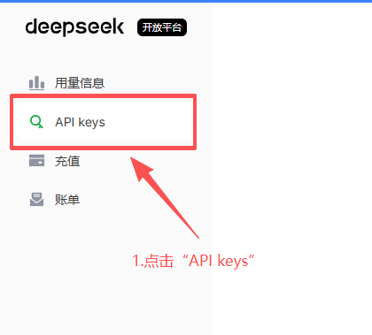
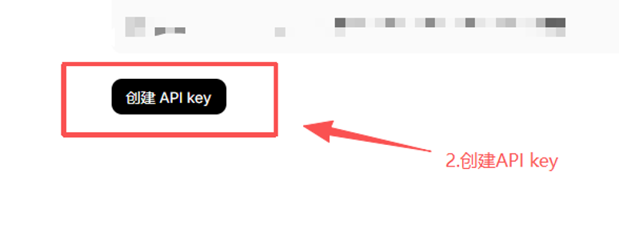
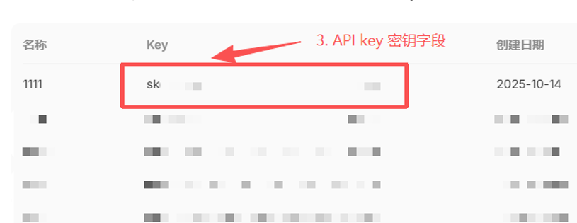
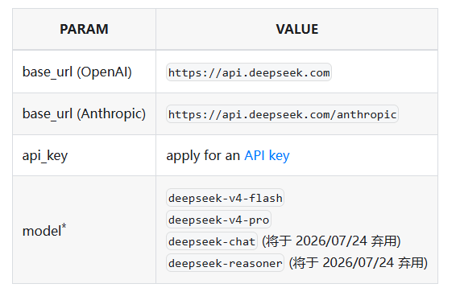

# Get API Key

Many model providers offer an "OpenAI-compatible API". To configure ByteMind, collect these four values from your provider:

| Info | ByteMind field | Example |
| ---- | -------------- | ------- |
| Provider type | `provider.type` | `openai-compatible` |
| API endpoint | `provider.base_url` | `https://api.deepseek.com` |
| Model ID | `provider.model` | `deepseek-v4-flash` |
| API key | `provider.api_key` | `sk-...` |

This page uses DeepSeek as an example. Other OpenAI-compatible providers follow the same general flow: find the API key first, then find the base URL and model ID.

## Step 1: Open the Provider Console

Open [DeepSeek Platform](https://platform.deepseek.com/api_keys), sign in, and go to the API Keys page.



If you do not have usable balance, check your balance or top-up status first. API calls are usually billed by token usage. DeepSeek's official documentation says fees are deducted from topped-up or granted balance; prices may change, so use the [Models & Pricing](https://api-docs.deepseek.com/quick_start/pricing) page as the source of truth.

## Step 2: Create an API Key

Create a new key on the API Keys page. After creation, copy the full key and store it somewhere safe on your machine. You will use it when configuring ByteMind.





Do not share your API key with others, and do not commit it to a public repository. For beginners, writing it into your local `~/.bytemind/config.json` is the most direct option; once you are comfortable, you can switch to environment variables.

## Step 3: Read the API Docs

Open DeepSeek's [First API Call](https://api-docs.deepseek.com/) documentation and focus on these fields:



| Doc name | ByteMind config | DeepSeek example |
| -------- | --------------- | ---------------- |
| `base_url (OpenAI)` | `provider.base_url` | `https://api.deepseek.com` |
|  | `provider.type` | `openai-compatible` |
| `api_key` | `provider.api_key` | The key you just created |
| `model` | `provider.model` | `deepseek-v4-flash` |

As of 2026-05-07, DeepSeek's official docs recommend OpenAI-format models including `deepseek-v4-flash` and `deepseek-v4-pro`. The older model names `deepseek-chat` and `deepseek-reasoner` are marked for deprecation on 2026-07-24, so new configs should prefer `deepseek-v4-flash` (the web app's "Fast Mode") or `deepseek-v4-pro` (the web app's "Expert Mode").

## Step 4: Write the ByteMind Config

Replace `YOUR_DEEPSEEK_API_KEY` with the key you just copied.

<Tabs default-tab="PowerShell">
<Tab title="PowerShell">

```powershell
New-Item -ItemType Directory -Force "$env:USERPROFILE\.bytemind" | Out-Null
$config = @'
{
  "provider": {
    "type": "openai-compatible",
    "base_url": "https://api.deepseek.com",
    "model": "deepseek-v4-flash",
    "api_key": "YOUR_DEEPSEEK_API_KEY"
  }
}
'@

$utf8NoBom = New-Object System.Text.UTF8Encoding($false)
[System.IO.File]::WriteAllText("$env:USERPROFILE\.bytemind\config.json", $config, $utf8NoBom)
```

This writes `config.json` as UTF-8 without BOM, so it works consistently in both Windows PowerShell 5.1 and PowerShell 7+.

</Tab>

<Tab title="Linux">

```bash
mkdir -p ~/.bytemind
cat > ~/.bytemind/config.json <<'JSON'
{
  "provider": {
    "type": "openai-compatible",
    "base_url": "https://api.deepseek.com",
    "model": "deepseek-v4-flash",
    "api_key": "YOUR_DEEPSEEK_API_KEY"
  }
}
JSON
```

</Tab>

<Tab title="MacOS">

```bash
mkdir -p ~/.bytemind
cat > ~/.bytemind/config.json <<'JSON'
{
  "provider": {
    "type": "openai-compatible",
    "base_url": "https://api.deepseek.com",
    "model": "deepseek-v4-flash",
    "api_key": "YOUR_DEEPSEEK_API_KEY"
  }
}
JSON
```

</Tab>
</Tabs>

## Step 5: Verify It Works

Enter a specific project directory and start ByteMind:

```bash
bytemind
```

Try a very small task:

```text
Describe this project in one sentence.
```

If the model replies normally, your API key, base URL, and model ID are configured correctly.

## FAQ

**What should `provider.type` be?**

DeepSeek uses the OpenAI-compatible format, so use `openai-compatible`.

**Should `base_url` include `/v1`?**

DeepSeek's official OpenAI-format base URL is `https://api.deepseek.com`. ByteMind appends the default `/chat/completions` path, so do not add `/chat/completions` yourself.

**Can I use `api_key_env` instead of `api_key`?**

Yes, and it's safer. Replace `"api_key"` with `"api_key_env": "DEEPSEEK_API_KEY"`, then set the environment variable:

<Tabs default-tab="PowerShell">
<Tab title="PowerShell">

```powershell
# Temporary (current window only):
$env:DEEPSEEK_API_KEY = "sk-..."

# Permanent (survives reboots):
[Environment]::SetEnvironmentVariable("DEEPSEEK_API_KEY", "sk-...", "User")
```

</Tab>

<Tab title="Linux">

```bash
export DEEPSEEK_API_KEY="sk-..."
```

</Tab>

<Tab title="macOS">

```bash
export DEEPSEEK_API_KEY="sk-..."
```

</Tab>
</Tabs>

:::warning Don't set both `api_key` and `api_key_env`
If both are present, `api_key` takes priority and `api_key_env` is ignored. Use one or the other.
:::

**Can I use any model ID?**

No. The model ID must exactly match the name in the provider's documentation. For DeepSeek, start with `deepseek-v4-flash`; if you need stronger capability, switch to `deepseek-v4-pro` according to the official docs.

**What if it still fails?**

Check three things first: whether the key was copied completely, whether your provider balance is usable, and whether `base_url` or `model` has any extra or missing characters. See [Troubleshooting](/troubleshooting) for more checks.
